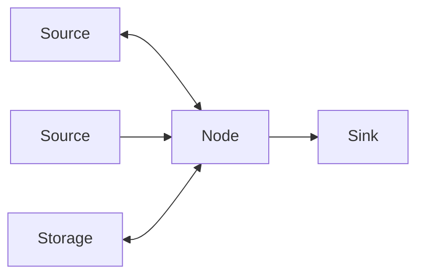
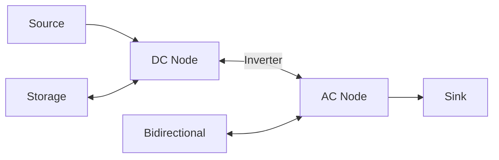
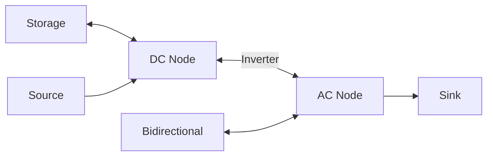

# Node

Virtual balance points enforcing power conservation (Kirchhoff's law).

!!! warning "Advanced Element"

    Node is available by default, but advanced source/sink configuration (`is_source` and `is_sink` fields) is only available when **Advanced Mode** is enabled on your hub.
    In standard mode, nodes are pure junctions with no generation or consumption capability.

## Configuration

| Field                       | Type    | Required | Default | Description                                         |
| --------------------------- | ------- | -------- | ------- | --------------------------------------------------- |
| **[Name](#name)**           | String  | Yes      | -       | Unique identifier for this node                     |
| **[Is Source](#is-source)** | Boolean | No       | false   | Whether node can produce power (Advanced Mode only) |
| **[Is Sink](#is-sink)**     | Boolean | No       | false   | Whether node can consume power (Advanced Mode only) |

## Name

Unique identifier for this node within your HAEO configuration.
Used to identify the node in connection endpoints.

Choose descriptive names based on electrical location: "Main Node", "AC Panel", "DC Bus", "Home Circuit"

## Is Source

Whether this node can produce power (act as a power source).
When `true`, the node can generate power that flows out through connections.

**Default**: `false` (node cannot produce power)

**Available only when Advanced Mode is enabled**.

## Is Sink

Whether this node can consume power (act as a power sink).
When `true`, the node can accept power that flows in through connections.

**Default**: `false` (node cannot consume power)

**Available only when Advanced Mode is enabled**.

### Source and Sink Combinations

The combination of `is_source` and `is_sink` determines the node's behavior:

**Pure Junction** (`is_source=false, is_sink=false` - default):

- Power must balance: all power flowing in equals all power flowing out
- No power generation or consumption at the node itself
- Most common configuration for standard nodes
- Available in standard mode (Advanced Mode not required)

**Source Only** (`is_source=true, is_sink=false`):

- Node can produce power that flows out through connections
- Cannot accept power from connections
- Useful for modeling power sources without using dedicated generation or grid elements

**Sink Only** (`is_source=false, is_sink=true`):

- Node can accept power that flows in through connections
- Cannot produce power
- Useful for modeling power sinks without using dedicated consumption elements

**Bidirectional** (`is_source=true, is_sink=true`):

- Node can both produce and consume power
- Useful for modeling bidirectional power sources or flexible power exchange points
- Similar to bidirectional grid elements but without automatic connection creation

## Purpose

Nodes are connection hubs where power balance is enforced:

$$
\text{Power In} = \text{Power Out}
$$

Nodes are not physical devices - they represent electrical junctions where Kirchhoff's current law applies.

!!! tip "Key insight"

    All elements function as nodes in the network.
    Explicit Node elements are only needed when you want an additional connection point without any associated device.

## Use Cases

**Single node (simple)**: Central hub for all elements.

Most residential systems use one node.

**Multiple nodes (complex)**: Separate AC/DC or hierarchical distribution.

Hybrid inverter systems with separate buses.

## Configuration Example

Simple node for connecting elements:

| Field    | Value     |
| -------- | --------- |
| **Name** | Main Node |

Then connect elements to "Main Node" via connections.

!!! warning "Deleting nodes"

    If you delete a node element, you must update all connections that reference it.
    Connections cannot have endpoints that don't exist.

## Sensors Created

A Node element creates 1 device in Home Assistant with the following sensors.

| Sensor                                          | Unit  | Description                     |
| ----------------------------------------------- | ----- | ------------------------------- |
| [`sensor.{name}_power_balance`](#power-balance) | \$/kW | Local energy price at this node |

### Power Balance

The marginal cost or value of power at this specific node in the network.
See the [Shadow Prices modeling guide](../../modeling/shadow-prices.md) for general shadow price concepts.

This shadow price represents the "local spot price" for energy at this connection point.
It shows how much the total system cost would change if you could inject or extract 1 kW of power at this node.

**Interpretation**:

- **Positive value**: Represents the cost of power at this node
    - Higher values indicate expensive power (e.g., importing during peak prices)
    - Shows what you would save by reducing consumption or adding generation at this node
- **Negative value**: Represents surplus power at this node (uncommon)
    - Indicates more generation than consumption
    - Shows the value that could be captured by adding loads or storage at this node
- **Differences between nodes**: Reveal the economic value of power transfer between network locations
    - Larger differences indicate stronger incentive for power flow between nodes
    - Help identify valuable connection points in the network

**Example**: A value of 0.22 means power at this node costs \$0.22 per kW at this time period, reflecting the marginal cost to supply this location in the network.

**Note**: For physical power measurements, monitor connected entity sensors instead.
Nodes only provide shadow prices, not physical power flow data.

---

All sensors include a `forecast` attribute containing future optimized values for upcoming periods.

## Troubleshooting

**Infeasible optimization**: Check all elements connected, sufficient sources exist, connection directions correct, limits not too restrictive.

**Unexpected power flows**: Verify connection endpoints, review node names unique, check connection min/max power limits.

## Multiple Nodes

**Use when**:

- Physical separation (AC/DC buses in hybrid inverter systems)
- Intermediate limits (inverter capacity, feeder constraints)
- Hierarchical distribution (main panel and sub-panels)

**Configuration**: Create multiple node elements, link them with connections.

**Complexity**: Requires more configuration and adds more constraints, but accurately models real system architecture.

### Hybrid Inverter Example

For hybrid (AC/DC) inverter systems, use separate AC and DC nodes with a connection between them:

The **connection** between DC and AC nodes represents the inverter.
Set connection power limits to match the inverter rating.

| Connection        | Max Power                            |
| ----------------- | ------------------------------------ |
| DC Node → AC Node | Inverter output rating (e.g., 10 kW) |
| AC Node → DC Node | Inverter input rating (e.g., 10 kW)  |

See [Connections](connections.md) for detailed configuration guidance.

## Next Steps

- :material-connection:{ .lg .middle } **Configure connections**

    ---

    Learn how to connect elements using power flow connections.

    [:material-arrow-right: Connections guide](connections.md)

- :material-math-integral:{ .lg .middle } **Node modeling**

    ---

    Understand the power balance formulation at nodes.

    [:material-arrow-right: Node modeling](../../modeling/device-layer/node.md)

- :material-chart-line:{ .lg .middle } **Understand optimization**

    ---

    See how power flows through nodes during optimization.

    [:material-arrow-right: Optimization results](../optimization.md)

