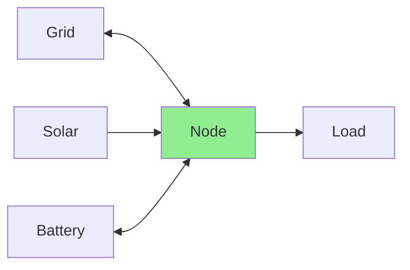
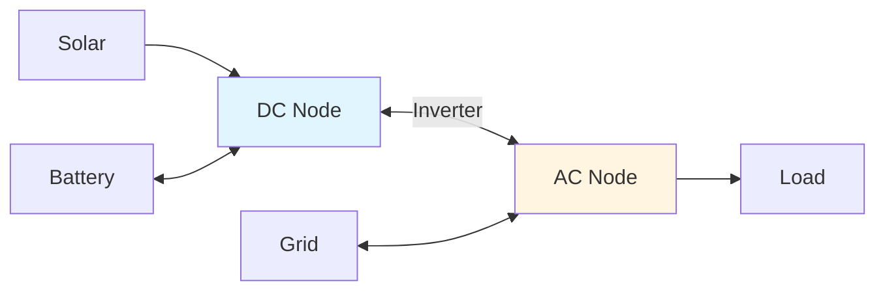
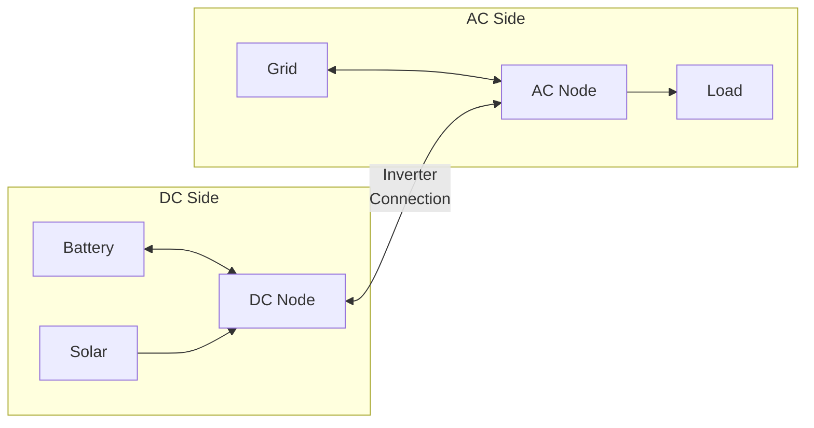

# Node Configuration

Virtual balance points enforcing power conservation (Kirchhoff's law).

## Configuration Fields

| Field    | Type   | Required | Default | Description       |
| -------- | ------ | -------- | ------- | ----------------- |
| **Name** | String | Yes      | -       | Unique identifier |
| **Type** | "Node" | Yes      | -       | Element type      |

## Name

Descriptive of electrical location: "Main Node", "AC Panel", "DC Bus", "Home Circuit"

## Purpose

Nodes are connection hubs where power balance is enforced:

$$
\text{Power In} = \text{Power Out}
$$

Not physical devices - represent electrical junctions.

## Use Cases

**Single node (simple)**: Central hub for all elements.



Most residential systems use one node.

**Multiple nodes (complex)**: Separate AC/DC or hierarchical distribution.



Hybrid inverter systems with separate buses.

## Configuration Example

```yaml
Name: Main Node
Type: Node
```

Then connect elements to "Main Node" via connections.

## No Sensors Created

Nodes are virtual - no physical measurements. Monitor connected entity sensors instead.

## Troubleshooting

**Infeasible optimization**: Check all elements connected, sufficient sources exist, connection directions correct, limits not too restrictive.

**Unexpected power flows**: Verify connection endpoints, review node names unique, check connection min/max power limits.

## Multiple Nodes

**Use when**:

- Physical separation (AC/DC)
- Intermediate limits (inverter, feeder capacity)
- Hierarchical distribution

**Configuration**: Create multiple nodes, link with connections (e.g., inverter between DC and AC nodes).

**Complexity**: More configuration, more constraints, but models real architecture accurately.

## Hybrid Inverter Modeling

For hybrid (AC/DC) inverter systems, use separate AC and DC nodes with a connection between them:



The **connection** between DC and AC nodes represents the inverter.
Set connection power limits to match the inverter rating.

See [Connections](connections.md) for configuring the inverter connection.

## Related Documentation

- [Node Modeling](../../modeling/node.md)
- [Mathematical Modeling](../../modeling/index.md)
- [Connections Guide](connections.md)

[:octicons-arrow-right-24: Continue to Connections Guide](connections.md)
