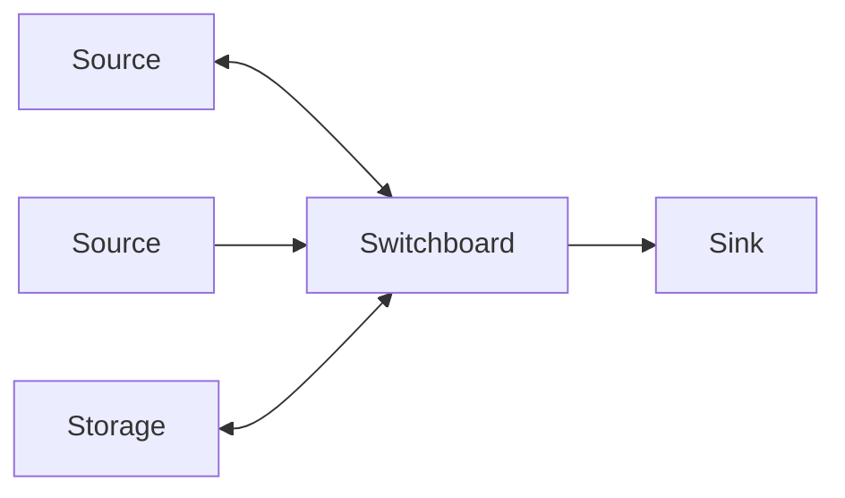
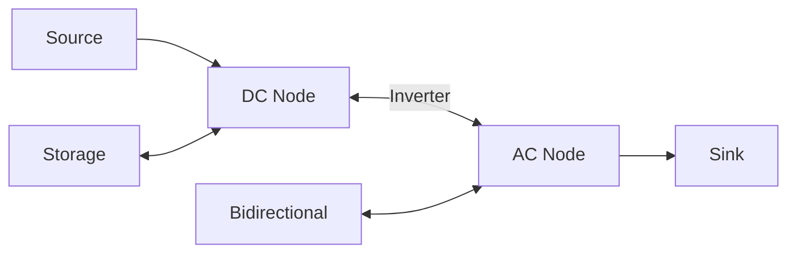
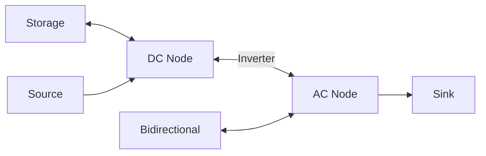

# Node

Virtual balance points enforcing power conservation (Kirchhoff's law).

!!! warning "Advanced Element"

    A switchboard node is created automatically when you set up a HAEO hub.
    Creating **additional** nodes requires **Advanced Mode** to be enabled on your hub.
    In standard mode, the automatic switchboard node is sufficient for most residential systems.

!!! note "Connection endpoints"

    Node elements always appear in connection selectors regardless of Advanced Mode setting.

## Configuration

| Field             | Type   | Required | Default | Description                     |
| ----------------- | ------ | -------- | ------- | ------------------------------- |
| **[Name](#name)** | String | Yes      | -       | Unique identifier for this node |

See [Where values are measured](../measurement-points.md) for the convention HAEO uses for where limits, prices, and reported power apply.

## Name

Unique identifier for this node within your HAEO configuration.
Used to identify the node in connection endpoints.

Choose descriptive names based on electrical location: "Main Node", "AC Panel", "DC Bus", "Home Circuit"

## Pure junctions

Every node is a pure junction: all power flowing in equals all power flowing out.
A node cannot produce or consume power itself.
Power enters and leaves the network only through elements that set a price and a limit on it, such as a [grid](grid.md), [solar](solar.md), [battery](battery.md), or [load](load.md).

!!! info "Nodes and power policies"

    Nodes pass [power policy](../../modeling/tagged-power.md) provenance through unchanged.
    This is what lets a `Solar → Grid` policy price the whole chain through your switchboard and inverter.
    Nodes are not offered as policy sources or destinations, because power never starts or ends at a node.
    See [Node roles and policy scope](../../modeling/tagged-power.md#node-roles-and-policy-scope) for the full rules.

!!! note "Source and sink nodes"

    Earlier versions of HAEO let you mark a node as a power source or sink.
    Such a node supplied or absorbed unlimited power at no cost, which let the optimizer invent free energy and sell it through a grid connection.
    HAEO now removes these options from existing nodes automatically when it upgrades your configuration, and logs a warning for each node that had either option turned on.
    If you used a source or sink node deliberately, replace it with a [grid](grid.md), [solar](solar.md), or [load](load.md) element so the power it supplies or absorbs is bounded and priced.

## Purpose

Nodes are connection hubs where power balance is enforced:

$$
\text{Power In} = \text{Power Out}
$$

Nodes are not physical devices - they represent electrical junctions where Kirchhoff's current law applies.

!!! tip "Automatic switchboard"

    HAEO creates a switchboard node automatically when you set up a hub.
    This central connection point is sufficient for most residential energy systems.
    You only need to create additional nodes if you have complex multi-bus topologies (e.g., separate AC/DC buses).

    If the switchboard node is accidentally deleted in non-advanced mode, HAEO will automatically recreate it on the next integration reload to maintain network connectivity.

!!! tip "Key insight"

    All elements function as nodes in the network.
    Explicit Node elements are only needed when you want an additional connection point without any associated device.

## Use Cases

**Single node (simple)**: Central hub for all elements.

```mermaid
graph LR
    Source1[Source] <--> Node[Switchboard]
    Source2[Source] --> Node
    Storage[Storage] <--> Node
    Node --> Sink[Sink]

    class Node emphasis
```

Most residential systems use the automatic switchboard node only.
Additional nodes are not needed unless you have complex multi-bus topologies.

**Multiple nodes (complex)**: Separate AC/DC or hierarchical distribution.

```mermaid
graph LR
    Source[Source] --> DC[DC Node]
    Storage[Storage] <--> DC
    DC<-->|Inverter|AC[AC Node]
    Bidirectional[Bidirectional] <--> AC
    AC-->Sink[Sink]

    class DC dc
    class AC ac
```

Hybrid inverter systems with separate buses.

## Configuration Example

Simple node for connecting elements:

| Field    | Value     |
| -------- | --------- |
| **Name** | Main Node |

Then connect elements to "Main Node" via connections.

!!! warning "Deleting nodes"

    If you delete a node element, you must update all connections that reference it.
    Connections cannot have endpoints that don't exist.

    **In non-advanced mode**: If you delete the switchboard node, HAEO will automatically recreate it the next time the integration reloads (on restart or configuration change) to ensure network connectivity is maintained.

## Sensors Created

### Sensor Summary

A Node element creates 1 device in Home Assistant with the following sensors.

| Sensor                                          | Unit   | Description                     |
| ----------------------------------------------- | ------ | ------------------------------- |
| [`sensor.{name}_power_balance`](#power-balance) | \$/kWh | Local energy price at this node |

### Power Balance

The marginal cost or value of power at this specific node in the network.
See the [Shadow Prices modeling guide](../../modeling/shadow-prices.md) for general shadow price concepts.

This shadow price represents the "local spot price" for energy at this connection point.
It shows how much the total system cost would change if you could inject or extract 1 kW of power at this node.

**Interpretation**:

- **Positive value**: Represents the cost of power at this node
    - Higher values indicate expensive power (e.g., importing during peak prices)
    - Shows what you would save by reducing consumption or adding generation at this node
- **Negative value**: Represents surplus power at this node (uncommon)
    - Indicates more generation than consumption
    - Shows the value that could be captured by adding loads or storage at this node
- **Differences between nodes**: Reveal the economic value of power transfer between network locations
    - Larger differences indicate stronger incentive for power flow between nodes
    - Help identify valuable connection points in the network

**Example**: A value of 0.22 means power at this node costs \$0.22 per kW at this time period, reflecting the marginal cost to supply this location in the network.

**Note**: For physical power measurements, monitor connected entity sensors instead.
Nodes only provide shadow prices, not physical power flow data.

---

All sensors include a `forecast` attribute containing future optimized values for upcoming periods.

## Troubleshooting

**Infeasible optimization**: Check all elements connected, sufficient sources exist, connection directions correct, limits not too restrictive.

**Unexpected power flows**: Verify connection endpoints, review node names unique, check connection min/max power limits.

## Multiple Nodes

**Use when**:

- Physical separation (AC/DC buses in hybrid inverter systems)
- Intermediate limits (inverter capacity, feeder constraints)
- Hierarchical distribution (main panel and sub-panels)

**Configuration**: Enable Advanced Mode on your hub, then create additional node elements and link them with connections.

**Complexity**: Requires more configuration and adds more constraints, but accurately models real system architecture.

### Hybrid Inverter Example

For hybrid (AC/DC) inverter systems, use separate AC and DC nodes with a connection between them:

```mermaid
graph LR
    Storage[Storage] <--> DC[DC Node]
    Source[Source] --> DC
    DC <-->|Inverter| AC[AC Node]
    Bidirectional[Bidirectional] <--> AC
    AC --> Sink[Sink]
```

The **connection** between DC and AC nodes represents the inverter.
Set connection power limits to match the inverter rating.

| Connection        | Max Power                            |
| ----------------- | ------------------------------------ |
| DC Node → AC Node | Inverter output rating (e.g., 10 kW) |
| AC Node → DC Node | Inverter input rating (e.g., 10 kW)  |

See [Connections](connections.md) for detailed configuration guidance.

## Next steps

- :material-connection:{ .lg .middle } **Configure connections**

    ---

    Learn how to connect elements using power flow connections.

    [:material-arrow-right: Connections guide](connections.md)

- :material-math-integral:{ .lg .middle } **Node modeling**

    ---

    Understand the power balance formulation at nodes.

    [:material-arrow-right: Node modeling](../../modeling/device-layer/node.md)

- :material-chart-line:{ .lg .middle } **Understand optimization**

    ---

    See how power flows through nodes during optimization.

    [:material-arrow-right: Optimization results](../optimization.md)

