# Grid Configuration

The grid entity represents your connection to the electricity network.
It allows bidirectional power flow: importing (buying) electricity and exporting (selling) electricity.

## Overview

A grid in HAEO represents:

- **Import capability**: Buying electricity from the grid
- **Export capability**: Selling electricity to the grid
- **Pricing**: Cost to import, revenue from export (via forecasts)
- **Power limits**: Optional maximum import/export rates

## Configuration Fields

| Field            | Type               | Required | Default | Description                                              |
| ---------------- | ------------------ | -------- | ------- | -------------------------------------------------------- |
| **Name**         | String             | Yes      | -       | Unique identifier (e.g., "Main Grid", "Grid Connection") |
| **Import Price** | Forecast sensor(s) | Yes      | -       | Price per kWh for importing electricity                  |
| **Export Price** | Forecast sensor(s) | Yes      | -       | Revenue per kWh for exporting electricity                |
| **Import Limit** | Number (kW)        | No       | -       | Maximum import power                                     |
| **Export Limit** | Number (kW)        | No       | -       | Maximum export power                                     |

### Name

Use descriptive, user-friendly names without special characters:

- ✅ "Main Grid", "Grid Connection", "House Meter"
- ❌ "Main_Grid", "grid1", "grd"

### Import Price

**Forecast sensor(s)** providing electricity import prices over time.

- **Format**: Single sensor or list of sensors
- **Unit**: \$/kWh
- **Required**: Yes

**Single forecast sensor**:

```yaml
Import Price: sensor.electricity_import_price
```

**Multiple forecast sensors** (e.g., today + tomorrow):

```yaml
Import Price:
  - sensor.electricity_import_price_today
  - sensor.electricity_import_price_tomorrow
```

HAEO automatically merges multiple forecasts into a continuous timeline.

!!! info "Forecast Sensors Required"

    Grid pricing **must** be provided via forecast sensors.
    Even for fixed pricing, create a forecast sensor that returns a constant value.

    See [Forecasts & Sensors](../forecasts-and-sensors.md) for examples of creating constant-price forecast sensors and time-of-use tariff sensors.

### Export Price

**Forecast sensor(s)** providing electricity export revenue over time.

- **Format**: Single sensor or list of sensors
- **Unit**: \$/kWh
- **Required**: Yes

Same configuration options as import price.

!!! info "Export vs Import Pricing"

    Typically, export prices are lower than import prices:

    - **Import**: \$0.25/kWh (what you pay)
    - **Export**: \$0.10/kWh (what you receive)

    This price difference incentivizes self-consumption and strategic battery usage.

### Import Limit

Maximum power that can be imported from the grid (kW).

- **Optional** - if not specified, import is unlimited.

Use this to model:

- Main breaker capacity

- Grid connection limits

- Fuse ratings

- **Example**: `10` for 10 kW maximum import

### Export Limit

Maximum power that can be exported to the grid (kW).

- **Optional** - if not specified, export is unlimited.

Use this to model:

- Inverter export limits

- Grid connection agreements

- Feed-in tariff restrictions

- **Example**: `5` for 5 kW maximum export

!!! warning "Regulatory Limits"

    Some jurisdictions limit export to a percentage of import capacity, or prohibit export entirely.
    Configure accordingly.

## Configuration Examples

### Dynamic Pricing

Using forecast sensors from an integration:

```yaml
Name: Main Grid
Import Price:
  - sensor.amber_general_price
  - sensor.amber_forecast_price
Export Price:
  - sensor.amber_feed_in_price
  - sensor.amber_feed_in_forecast
Import Limit: 15 kW
Export Limit: 10 kW
```

### Time-of-Use Tariff

Using a template sensor for fixed time-of-use pricing:

```yaml
Name: Grid Connection
Import Price: sensor.tou_import_price
Export Price: sensor.tou_export_price
Import Limit: 20 kW
Export Limit: 5 kW
```

See [Forecasts & Sensors](../forecasts-and-sensors.md#time-of-use-tariff) for creating time-of-use template sensors.

### Fixed Pricing

Using a template sensor for constant prices:

```yaml
Name: Main Grid
Import Price: sensor.constant_import_price
Export Price: sensor.constant_export_price
```

See [Forecasts & Sensors](../forecasts-and-sensors.md#constant-price-as-forecast) for creating constant-price template sensors.

### Export-Only Grid

For systems that can't import:

```yaml
Name: Export Grid
Import Price: sensor.very_high_import_price # Set to prohibitively high price
Export Price: sensor.feed_in_price
Import Limit: 0.001 kW # Minimal import allowed
```

## Forecast Integration Compatibility

HAEO works with any Home Assistant integration that provides forecast attributes.
Common integrations for electricity pricing:

- Amber Electric (Australia)
- Nordpool (Europe)
- Tibber (Europe)
- Octopus Energy (UK)
- Custom template sensors

See the complete list in [Forecasts & Sensors](../forecasts-and-sensors.md#supported-forecast-integrations).

## Dynamic Pricing Benefits

When you configure dynamic pricing through forecast sensors, HAEO:

1. **Reads price forecasts** at each optimization cycle
2. **Plans ahead** to minimize total cost over the horizon
3. **Charges batteries** when prices are low
4. **Discharges batteries** when prices are high
5. **Adjusts export** based on export price forecasts

Example optimization behavior with time-of-use pricing:

```mermaid
gantt
    title Battery Strategy with Time-of-Use Pricing
    dateFormat HH:mm
    axisFormat %H:%M

    section Price
    Off-Peak $0.15: 00:00, 06:00
    Shoulder $0.25: 06:00, 16:00
    Peak $0.45: 16:00, 21:00
    Shoulder $0.25: 21:00, 24:00

    section Battery
    Charge from Grid: 00:00, 06:00
    Charge from Solar: 10:00, 16:00
    Discharge to Load: 16:00, 21:00
```



## How HAEO Uses Grid Configuration

### Import Modeling

Import represents purchasing electricity:

- **Positive cost**: Increases total system cost
- **Power variable**: Optimization determines import power at each time step
- **Price impact**: Higher prices reduce import, encourage battery discharge

### Export Modeling

Export represents selling electricity:

- **Negative cost**: Reduces total system cost (revenue)
- **Power variable**: Optimization determines export power at each time step
- **Price impact**: Higher export prices encourage more export

### Net Grid Power

The grid can import or export, but not simultaneously:

- Positive power = importing from grid
- Negative power = exporting to grid

## Sensors Created

HAEO creates this sensor for each grid:

| Sensor                | Description                                                         |
| --------------------- | ------------------------------------------------------------------- |
| `sensor.{name}_power` | Optimal grid power (kW). Positive = importing, negative = exporting |

The sensor includes forecast attributes with future timestamped values.

## Troubleshooting

### Grid Always Importing

If your system always imports and never uses battery/solar:

1. **Check price forecasts**: Ensure forecasts are working (see [forecasts troubleshooting](../forecasts-and-sensors.md#troubleshooting-forecasts))
2. **Verify pricing**: Ensure import price > export price
3. **Review connections**: Grid must be connected to other entities
4. **Check battery SOC**: Battery may be at minimum SOC

### Grid Always Exporting

If your system exports even when import would be cheaper:

1. **Check export limits**: May be forcing export
2. **Verify pricing**: Ensure export price < import price
3. **Review load configuration**: May have load misconfigured

### Price Forecasts Not Working

If HAEO isn't responding to price changes:

1. **Check forecast format**: See [forecast requirements](../forecasts-and-sensors.md#forecast-attribute-format)
2. **Verify timestamps**: Must be ISO format with timezone
3. **Check sensor updates**: Ensure forecasts update regularly
4. **Review horizon**: Forecasts must cover the optimization horizon

See the [troubleshooting guide](../troubleshooting.md) for more solutions.

## Multiple Grids

Some installations have multiple grid connections:


Configure separate grid entities for:

- Different pricing structures
- Separate import/export meters
- Multiple connection points

## Hybrid Inverter Modeling

For hybrid (AC/DC) inverter systems, model the inverter as a **connection** between AC and DC nets:


The connection between DC and AC nets represents the inverter.
Connection power limits should match the inverter rating.

See [Connection Configuration](../connections.md#hybrid-inverters) for details.

## Related Documentation

- [Forecasts & Sensors](../forecasts-and-sensors.md) - Creating price forecast sensors
- [Battery Configuration](battery.md) - Batteries work with grid pricing
- [Connections](../connections.md) - Connect grid to your network
- [Grid Modeling](../../modeling/grid.md) - Mathematical formulation
- [Troubleshooting Forecasts](../troubleshooting.md#forecasts-are-not-long-enough) - Forecast issues

## Next Steps

After configuring your grid:

1. [Add a battery](battery.md) to store cheap electricity
2. [Add solar](photovoltaics.md) to generate free electricity
3. [Define connections](../connections.md) between components
4. [View results](../optimization.md) to see optimal power flows

[:octicons-arrow-right-24: Continue to Photovoltaics Configuration](photovoltaics.md)
