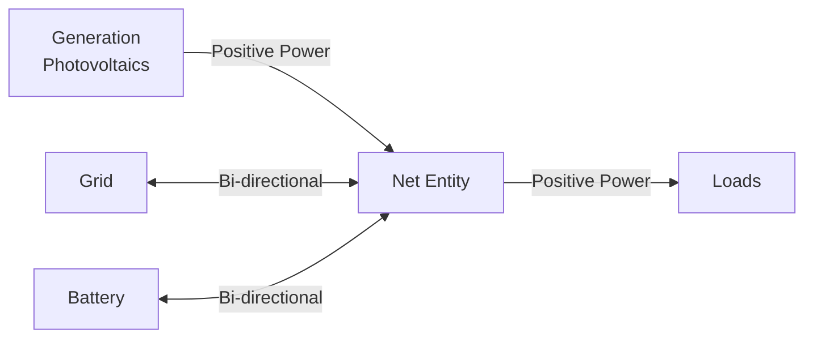

# Entity Types

Entities are the building blocks of your HAEO energy network. Each entity represents a physical device or logical grouping in your energy system.

## Available Entity Types

HAEO supports six types of entities:

### Energy Storage

- **[Battery](battery.md)** - Energy storage devices with state of charge tracking

### Generation

- **[Photovoltaics](photovoltaics.md)** - Solar power generation with forecast integration

### Grid Connection

- **[Grid](grid.md)** - Bi-directional grid import/export with pricing

### Consumption

- **[Constant Load](loads.md#constant-load)** - Fixed power consumption
- **[Forecast Load](loads.md#forecast-load)** - Variable consumption with forecasts

### Virtual Entities

- **[Net](net.md)** - Virtual metering points for power balance

## Entity Comparison

| Entity        | Power Direction  | Energy Storage | Requires Forecast    | Configuration Complexity |
| ------------- | ---------------- | -------------- | -------------------- | ------------------------ |
| Battery       | Bi-directional   | Yes            | No (only SOC sensor) | Medium                   |
| Grid          | Bi-directional   | No             | Optional (prices)    | Low                      |
| Photovoltaics | Generation only  | No             | Yes                  | Low                      |
| Constant Load | Consumption only | No             | No                   | Very Low                 |
| Forecast Load | Consumption only | No             | Yes                  | Low                      |
| Net           | Pass-through     | No             | No                   | Very Low                 |

## Common Configuration Fields

All entities share some common fields:

### Name

A unique identifier for the entity within your network.

- Must be unique across all entities in the network
- Used in [connections](../connections.md) to reference the entity
- Appears in sensor entity IDs

!!! tip "Naming Convention"
Use descriptive names that indicate the entity's purpose:

    - `Main_Battery` instead of `Battery1`
    - `Grid_Import` instead of `Grid`
    - `Rooftop_Solar` instead of `PV`

### Element Type

Automatically set based on which entity type you're adding. Cannot be changed after creation.

## Power Flow Directions

Understanding power flow directions is important for configuring your network correctly:



- **Generation** (Photovoltaics): Always positive power (producing energy)
- **Loads**: Always positive power (consuming energy)
- **Bi-directional** (Battery, Grid): Can be positive or negative depending on direction

See the [power balance modeling](../../modeling/power-balance.md) documentation for mathematical details.

## Required Sensors

Different entity types require different Home Assistant sensors:

### Battery

- **SOC Sensor**: Current state of charge (percentage)

Example: `sensor.battery_state_of_charge`

### Grid

- **Price Sensors**: Import/export electricity prices (optional, can use constants)

Example: `sensor.electricity_import_price`, `sensor.electricity_export_price`

### Photovoltaics

- **Forecast Sensors**: Solar power generation forecast

Example: `sensor.solar_forecast_today`, `sensor.solar_forecast_tomorrow`

### Forecast Load

- **Forecast Sensors**: Consumption forecast

Example: `sensor.load_forecast_today`, `sensor.load_forecast_tomorrow`

!!! info "Forecast Format"
Forecast sensors should provide attributes with timestamped power values. See the [Forecasts & Sensors guide](../forecasts-and-sensors.md) for details.

## Sensor Requirements

### State of Charge Sensors

For batteries, the SOC sensor must report percentage (0-100):

```yaml
# Example sensor
sensor:
  - platform: template
    sensors:
      battery_soc:
        value_template: "{{ states('sensor.battery_soc_raw') }}"
        unit_of_measurement: "%"
        device_class: battery
```

### Price Sensors

Price sensors should report cost per kWh:

```yaml
# Example constant price sensor
sensor:
  - platform: template
    sensors:
      fixed_import_price:
        value_template: "0.25"
        unit_of_measurement: "$/kWh"
```

For forecast-based pricing, see the [grid configuration guide](grid.md#dynamic-pricing).

### Forecast Sensors

Forecast sensors must provide future timestamped values in attributes. HAEO supports several common forecast integration formats:

- **[Open-Meteo Solar Forecast](https://github.com/rany2/ha-open-meteo-solar-forecast)**
- **Solcast Solar**
- **Amber Electric** (for pricing)
- **Custom forecast sensors**

See individual entity pages for detailed forecast configuration.

## Entity Lifecycle

### Creation

1. Entities are added through the HAEO options flow
2. HAEO validates the configuration
3. Sensors are created for the entity
4. The network is rebuilt with the new entity
5. Optimization runs with the updated network

### Modification

1. Edit entity through options flow
2. Configuration is validated
3. Existing sensors are updated
4. Network is rebuilt
5. New optimization runs

!!! warning "Sensor Entity IDs"
Editing an entity's name will change its sensor entity IDs. Update any automations or dashboards that reference the old sensor names.

### Deletion

1. Remove entity through options flow
2. Associated connections are automatically removed
3. Sensors are deleted
4. Network is rebuilt without the entity

!!! danger "Cascade Effects"
Removing an entity removes all connections involving that entity. Ensure your network remains [properly connected](../troubleshooting.md#graph-isnt-connected-properly) after removal.

## Best Practices

### Start with Essential Entities

Begin with the minimum viable configuration:

1. Grid (for import/export)
2. One battery or one PV system
3. Add connections between them

Verify optimization works before adding complexity.

### Use Realistic Constraints

Configure power and energy limits based on actual device specifications:

- Check your battery's datasheet for capacity and power ratings
- Use inverter limits for solar curtailment
- Set grid limits based on your connection size

### Group Related Entities

For complex systems, use descriptive names to group related entities:

- `Upstairs_Battery` and `Downstairs_Battery`
- `East_Solar` and `West_Solar`
- `HVAC_Load` and `Base_Load`

### Monitor Entity Performance

Check the sensors created for each entity:

- Power sensors show optimal power at each time step
- Energy sensors track battery levels
- SOC sensors show battery state of charge

If values seem unrealistic, review your configuration constraints.

## Next Steps

Explore detailed configuration for each entity type:

<div class="grid cards" markdown>

- [Battery Configuration](battery.md)

  Energy storage with SOC tracking and efficiency modeling.

- [Grid Configuration](grid.md)

  Import/export with dynamic or fixed pricing.

- [Photovoltaics Configuration](photovoltaics.md)

  Solar generation with curtailment options.

- [Load Configuration](loads.md)

  Constant and forecast-based consumption.

- [Net Configuration](net.md)

  Virtual power balance nodes.

</div>
