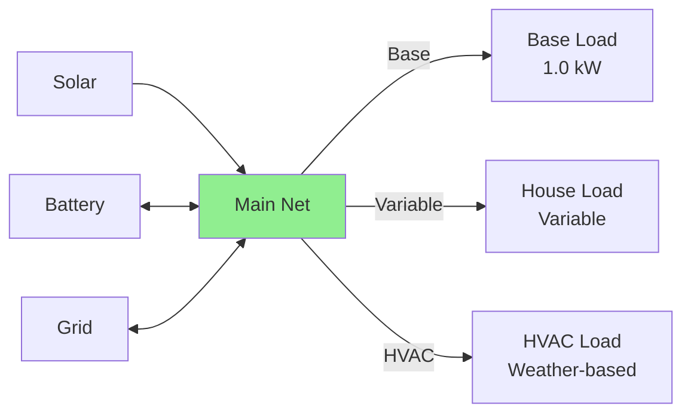

# Load Configuration

Loads represent electricity consumption in your system.
HAEO supports two types: constant loads (fixed power) and forecast loads (variable power that changes over time).

## Overview

A load in HAEO represents electrical consumption that must be met:

- **Non-controllable**: HAEO cannot reduce or shift load (it's fixed demand)
- **Must be satisfied**: Power balance ensures load is always met
- **Two types**: Constant (fixed) or forecast (time-varying)
- **Drives optimization**: Load magnitude and timing influence battery and grid decisions

Loads represent the **demand side** of your energy equation - what must be supplied by solar, battery, and/or grid.

## Load Types Comparison

| Aspect             | Constant Load         | Forecast Load              |
| ------------------ | --------------------- | -------------------------- |
| Power over time    | Fixed value           | Varies by forecast         |
| Configuration      | Single power value    | Forecast sensor(s)         |
| Use case           | Baseline consumption  | Time-varying loads         |
| Complexity         | Simplest              | Requires forecast          |
| Accuracy           | Approximate           | Can be very accurate       |

**When to use constant**: Stable baseline consumption, simple setup, or no forecasting capability.

**When to use forecast**: Significant load variation, weather-dependent (HVAC), or scheduled activities (EV charging).

**Best practice**: Combine both - constant for baseline, forecast for variable loads.

## Constant Load

Fixed power consumption that remains the same at all times.

### Configuration Fields

| Field    | Type        | Required | Default | Description                          |
| -------- | ----------- | -------- | ------- | ------------------------------------ |
| **Name** | String      | Yes      | -       | Unique identifier                    |
| **Type** | "Constant Load" | Yes  | -       | Must select "Constant Load"          |
| **Power**| Number (kW) | Yes      | -       | Fixed power consumption              |

#### Name

Use descriptive names that indicate what the load represents:

- ✅ "Base Load", "Always On Devices", "Continuous Load", "Baseline Consumption"
- ❌ "Load1", "load", "l1"

#### Power

Constant power consumption value in kW.

- **Type**: Number
- **Unit**: kW (kilowatts)
- **Required**: Yes

**How to determine**:

1. **Measure overnight consumption**: Minimum power when most devices are off
2. **List always-on devices**: Refrigerator, network equipment, standby power
3. **Add 10-20% margin**: Account for unmeasured consumption

**Example values**:

| System Type           | Typical Constant Load |
| --------------------- | --------------------- |
| Small apartment       | 0.2-0.4 kW            |
| Average home          | 0.5-1.2 kW            |
| Large home            | 1.0-2.0 kW            |
| Home office           | 1.5-3.0 kW            |
| Small business        | 3-10 kW               |

**Common always-on devices**:

- Refrigerator/freezer: 100-200 W
- Network equipment: 50-100 W
- Security system: 10-20 W
- Standby power (all devices): 50-200 W
- Server/NAS: 100-300 W

### Example Configuration

```yaml
Name: Base Load
Type: Constant Load
Power: 1.2
```

**Represents**: 1.2 kW continuous consumption (refrigerator, network, standby devices).

### When to Use Constant Load

**Ideal for**:

- Baseline household consumption
- 24/7 equipment (servers, security systems)
- Approximate average load when forecasting is unavailable
- Conservative planning (set to typical maximum)

**Not ideal for**:

- Highly variable loads (HVAC, cooking)
- Scheduled activities (EV charging, laundry)
- Weather-dependent consumption

## Forecast Load

Variable power consumption that changes over time based on forecast data.

### Configuration Fields

| Field        | Type               | Required | Default | Description                     |
| ------------ | ------------------ | -------- | ------- | ------------------------------- |
| **Name**     | String             | Yes      | -       | Unique identifier               |
| **Type**     | "Forecast Load"    | Yes      | -       | Must select "Forecast Load"     |
| **Forecast** | Forecast sensor(s) | Yes      | -       | Power consumption forecast      |

#### Name

Use descriptive names indicating load type or source:

- ✅ "House Load", "HVAC Load", "Variable Consumption", "EV Charger", "Total Load"
- ❌ "Load2", "var_load", "forecast"

#### Forecast

Forecast sensor(s) providing power consumption predictions.

- **Format**: Single sensor or list of sensors
- **Unit**: kW (power, not energy)
- **Required**: Yes

**Single forecast sensor**:

```yaml
Forecast: sensor.house_load_forecast
```

**Multiple forecast sensors** (concatenate):

```yaml
Forecast:
  - sensor.load_forecast_today
  - sensor.load_forecast_tomorrow
```

**Forecast requirements**:

- Must cover optimization horizon (default: 48 hours)
- Values in kW representing expected consumption
- Should update regularly for accuracy

### Example Configuration

```yaml
Name: House Load
Type: Forecast Load
Forecast: sensor.total_consumption_forecast
```

**Represents**: Time-varying household consumption based on historical patterns, weather, and schedules.

### Creating Load Forecasts

Load forecasts typically come from:

**1. Historical patterns** (statistics integration):

```yaml
sensor:
  - platform: statistics
    name: "Load Forecast"
    entity_id: sensor.house_power
    state_characteristic: mean
    max_age:
      hours: 24
```

**2. Weather-based models** (for HVAC):

- Temperature-correlated consumption
- Heating/cooling degree days
- Custom template sensors

**3. Machine learning** (custom):

- Prophet, LSTM, or other ML models
- Trained on historical consumption
- Consider day of week, weather, occupancy

**4. Simple template sensors**:

```yaml
template:
  - sensor:
      - name: "Simple Load Forecast"
        unit_of_measurement: "kW"
        state: >
          
          
            3.5
          
            5.0
          
            2.0
          
```

### When to Use Forecast Load

**Ideal for**:

- Time-varying consumption (cooking, HVAC, hot water)
- Weather-dependent loads
- Scheduled activities (EV charging, pool pump)
- Occupancy-based consumption
- Accurate optimization

**Not ideal for**:

- Very stable consumption (use constant load)
- When forecasting is unavailable or unreliable
- When simplicity is preferred

## Configuration Examples

### Baseline Only (Simple)

Single constant load for minimal configuration:

```yaml
Name: Total House Load
Type: Constant Load
Power: 3.5
```

**Use case**: Simple systems, quick setup, conservative estimate.

**Limitation**: Doesn't capture load variation, less optimal battery usage.

### Baseline + Variable (Recommended)

Combine constant baseline with forecast variable load:

**Constant baseline**:

```yaml
Name: Base Load
Type: Constant Load
Power: 1.0
```

**Variable load**:

```yaml
Name: Variable Load
Type: Forecast Load
Forecast: sensor.variable_consumption_forecast
```

**Total load** = Constant (1.0 kW) + Forecast (varies)

**Benefit**: Captures both stable minimum and time-varying peaks.

### HVAC-Specific Load

Separate load for weather-dependent heating/cooling:

```yaml
Name: HVAC Load
Type: Forecast Load
Forecast: sensor.hvac_consumption_forecast
```

**Forecast based on**:

- Outside temperature
- Time of day
- Thermostat settings
- Historical HVAC consumption patterns

### EV Charging Load

Scheduled electric vehicle charging:

```yaml
Name: EV Charger
Type: Forecast Load
Forecast: sensor.ev_charging_schedule
```

**Forecast shows**:

- 0 kW when not charging
- 7 kW when charging scheduled
- Integrates with calendar or car integration

### Multiple Separate Loads

Different load types as separate entities:

**Base consumption**:

```yaml
Name: Baseline
Type: Constant Load
Power: 0.8
```

**HVAC**:

```yaml
Name: Heating Cooling
Type: Forecast Load
Forecast: sensor.hvac_forecast
```

**EV**:

```yaml
Name: Car Charging
Type: Forecast Load
Forecast: sensor.ev_schedule
```

**Benefit**: Clear separation, independent forecasts, easier debugging.

## How HAEO Uses Load Configuration

### Fixed Demand

Loads are **non-controllable** in HAEO:

- HAEO cannot reduce load
- HAEO cannot shift load to different times
- Load must always be satisfied

This is realistic - you cannot tell your refrigerator to consume less or your heating to turn off (within HAEO's model).

### Supply-Side Optimization

HAEO optimizes **how to meet the load**:

**Sources to meet load**:

1. Solar generation (free, when available)
2. Battery discharge (use stored cheap energy)
3. Grid import (pay current price)

**Example**: 5 kW load at peak price time

- Solar: 2 kW (use all available)
- Battery: 3 kW (discharge to avoid expensive grid)
- Grid: 0 kW (avoided peak price import)

**Cost savings** come from optimal source selection, not load reduction.

### Load Impact on Battery Strategy

Load magnitude and timing drive battery decisions:

**Low overnight load + high evening load**:

- Charge battery during off-peak overnight
- Hold battery during day (solar meets load)
- Discharge battery during evening peak
- Minimize grid import at expensive times

**High constant load**:

- Battery provides smaller percentage offset
- Grid import is higher overall
- Battery value is from arbitrage, not self-sufficiency

### Peak Load Handling

When load exceeds available generation + battery:

- **Grid must supply deficit**: No choice
- **Cost minimization still applies**: But limited by physical constraints
- **Battery pre-charging helps**: If peak was anticipated

**Example**: 8 kW evening peak, 5 kW battery max discharge

- Battery: 5 kW
- Grid import: 3 kW (unavoidable)
- Better than 8 kW from grid

## Sensors Created

HAEO creates these sensors for each load entity:

| Sensor           | Unit | Description                                |
| ---------------- | ---- | ------------------------------------------ |
| `{name}_power`   | kW   | Current load power (matches configured load) |

**Note**: Load power sensors typically just reflect the configured load (constant value or forecast).
They're provided for consistency with other entities.

**Example**:

```yaml
sensor.house_load_power:
  state: 4.2  # Current load consumption (kW)
  attributes:
    forecast:
      - datetime: "2025-10-12T11:05:00+00:00"
        value: 4.5
      - datetime: "2025-10-12T11:10:00+00:00"
        value: 4.3
      # ... more forecast values
```

## Troubleshooting

### Optimization Infeasible

If HAEO reports infeasible optimization:

1. **Check load magnitude**: Is load greater than max supply?
    - Max supply = Grid import limit + Solar + Battery discharge
2. **Verify load units**: Should be kW, not W or kWh
3. **Review import limits**: Does grid have sufficient import capacity?
4. **Check forecast values**: Are there unrealistic spikes?

**Fix**: Increase grid import limit or reduce load estimate.

### Load Forecast Inaccurate

If actual consumption differs significantly from forecast:

1. **Validate sensor data**: Check forecast sensor in developer tools
2. **Verify units**: Must be kW (power) not kWh (energy)
3. **Check update frequency**: Forecast should refresh regularly
4. **Review historical data**: Is forecast based on current patterns?
5. **Tune forecast model**: Adjust parameters or retrain model

**Impact**: Inaccurate forecasts lead to sub-optimal battery usage and grid import timing.

### Battery Not Discharging During Peak

If battery stays charged during high-price periods:

1. **Verify load is high enough**: Small loads may not justify discharge
2. **Check price differential**: Is peak price significantly higher?
3. **Review battery costs**: High degradation costs discourage cycling
4. **Examine forecast**: Is load forecast showing the peak?

**Often**: Battery is correctly optimizing - peak may not be high enough to justify discharge.

### Constant Load Too High/Low

If constant load doesn't match actual:

1. **Measure actual**: Check home energy monitor during quiet period
2. **Identify always-on devices**: List actual 24/7 consumption
3. **Adjust value**: Increase or decrease to match reality
4. **Consider forecast load**: May be better for variable consumption

**Too high**: Over-imports from grid, wastes battery capacity.
**Too low**: May cause infeasible problems if actual exceeds configured + generation.

## Multiple Loads

HAEO supports multiple load entities:

**Why multiple loads?**:

- Separate baseline and variable components
- Different forecast sources or methods
- Organizational clarity (HVAC, EV, base)
- Independent tracking

**Configuration**:

1. Create separate load entities
2. Use distinct names
3. Each connects to network independently
4. Total system load is automatic sum

**Example topology**:



**Power balance**:

$$
P_{\text{supply}} = P_{\text{base}} + P_{\text{variable}} + P_{\text{HVAC}}
$$

All loads sum automatically in power balance constraints.

## Related Documentation

- [Load Modeling](../../modeling/loads.md) - Mathematical details
- [Battery Configuration](battery.md) - Storage to offset peak loads
- [Grid Configuration](grid.md) - Import to meet excess load
- [Connections](../connections.md) - Connecting loads to network
- [Forecasts & Sensors](../forecasts-and-sensors.md) - Creating forecast sensors

## Next Steps

After configuring your loads:

- [Configure net entities](net.md) to define network balance points
- [Set up connections](../connections.md) to complete network topology
- [Review optimization results](../troubleshooting.md) to verify load is met

[:octicons-arrow-right-24: Continue to Net Entity Configuration](net.md)
