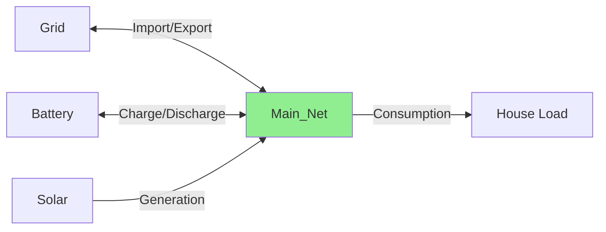
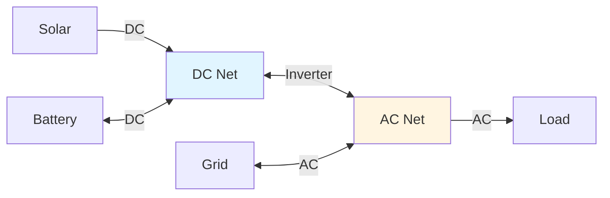
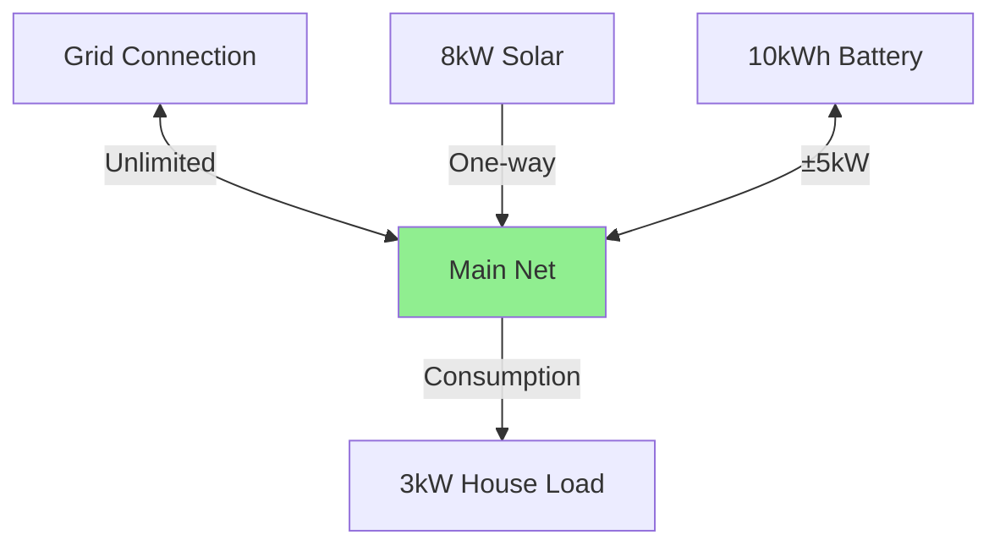
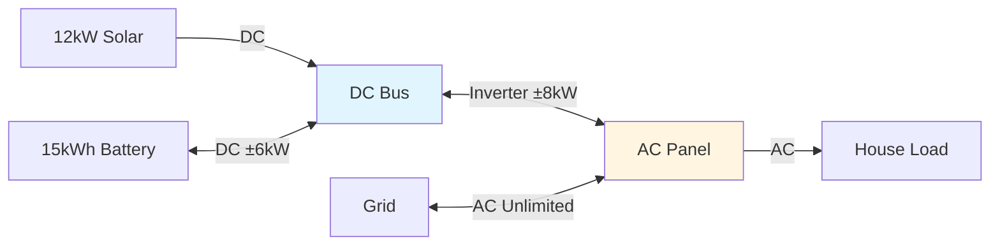
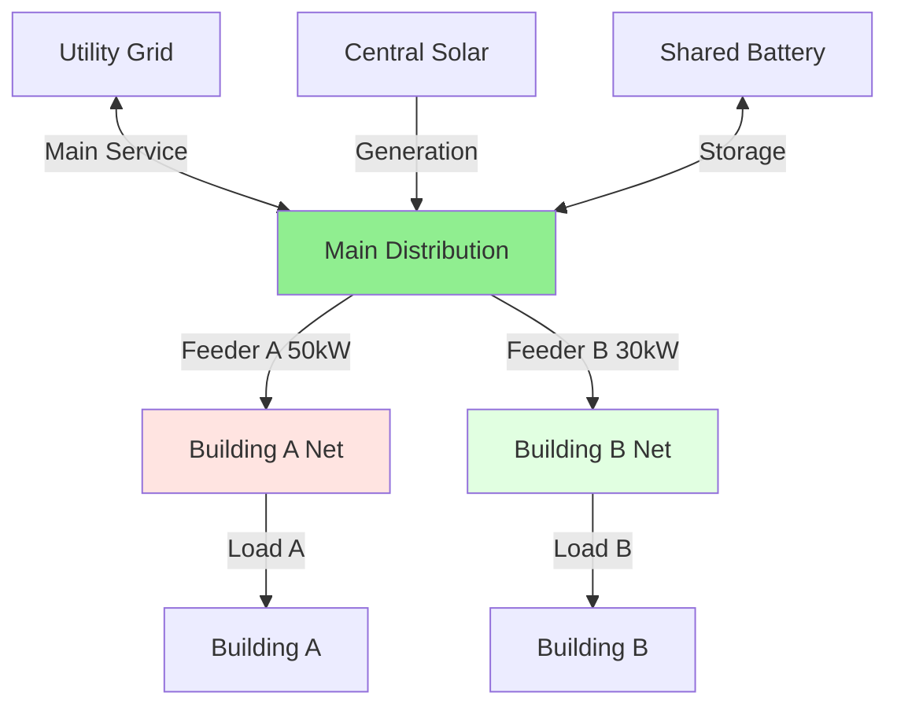
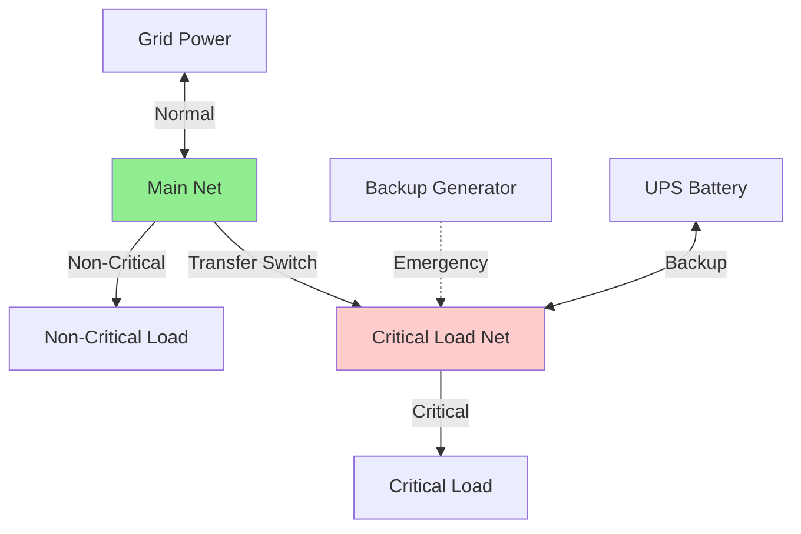

# Net Entity Configuration

Net entities are virtual nodes that represent power balance points in your network.
They don't physically exist but serve as electrical junctions where power flows are balanced.

## Overview

A net entity in HAEO represents:

- **Virtual balance point**: Not a physical device, but a conceptual node
- **Power balance enforcement**: All inflows must equal all outflows (Kirchhoff's law)
- **Connection hub**: Where multiple entities connect and exchange power
- **Network topology**: Enables modeling of complex electrical architectures

Think of a net entity as a **junction box** or **electrical bus** where wires meet and power is distributed.

## Configuration Fields

| Field    | Type   | Required | Default | Description                                     |
| -------- | ------ | -------- | ------- | ----------------------------------------------- |
| **Name** | String | Yes      | -       | Unique identifier for the balance point         |
| **Type** | "Net"  | Yes      | -       | Must select "Net"                               |

### Name

Use descriptive names that indicate the electrical location or purpose:

- ✅ "Main Net", "AC Panel", "DC Bus", "Distribution Point", "Building A Net"
- ❌ "Net1", "net", "n"

**Naming conventions**:

- Include voltage type if relevant: "AC_Net", "DC_Net"
- Include location: "Main_Panel", "Garage_Net"
- Include function: "Critical_Load_Net", "Solar_Distribution"

## When to Use Net Entities

### Single Net (Simple System)

**Most common configuration**: One net entity as central hub.



**Use case**: Standard residential system where all entities connect at one point.

**Power balance** at Main_Net:

$$
P_{\text{grid}} + P_{\text{solar}} + P_{\text{batt,out}} = P_{\text{load}} + P_{\text{batt,in}}
$$

**Configuration**:

```yaml
Name: Main Net
Type: Net
```

Then connect all other entities to "Main Net" via connections.

### Multiple Nets (Complex System)

**Advanced configuration**: Separate AC and DC sides or hierarchical distribution.



**Use case**: Hybrid inverter systems with separate DC and AC electrical buses.

**Power balances**:

At DC Net:

$$
P_{\text{solar}} + P_{\text{batt,out}} = P_{\text{inverter,out}} + P_{\text{batt,in}}
$$

At AC Net:

$$
P_{\text{inverter,in}} + P_{\text{grid,import}} = P_{\text{load}} + P_{\text{grid,export}}
$$

**Configuration**:

```yaml
# DC side
Name: DC Net
Type: Net

# AC side
Name: AC Net
Type: Net
```

Then connect DC entities to "DC Net", AC entities to "AC Net", and create inverter connection between nets.

## Configuration Examples

### Example 1: Simple Home System

**Single net hub**:

```yaml
Name: Main Net
Type: Net
```

**Entities connected**:

- Grid (bidirectional connection)
- Solar (unidirectional to net)
- Battery (bidirectional connection)
- House Load (unidirectional from net)

**Topology**:



**Behavior**: All power flows converge at Main Net, where balance is enforced every time step.

### Example 2: AC/DC Hybrid System

**Separate DC and AC nets**:

```yaml
# DC bus (solar and battery side)
Name: DC Bus
Type: Net

# AC panel (house and grid side)
Name: AC Panel
Type: Net
```

**Entities and connections**:

- Solar → DC Bus (DC generation)
- Battery ↔ DC Bus (DC storage)
- DC Bus ↔ AC Panel (hybrid inverter, 8 kW limit)
- Grid ↔ AC Panel (AC import/export)
- AC Panel → Load (AC consumption)

**Topology**:



**Behavior**:

- DC Bus balances solar, battery, and inverter power
- AC Panel balances inverter, grid, and load
- Inverter connection has 8 kW limit (bidirectional)

### Example 3: Multi-Building Campus

**Hierarchical distribution**:

```yaml
# Main distribution
Name: Main Distribution
Type: Net

# Building-specific nets
Name: Building A Net
Type: Net

Name: Building B Net
Type: Net
```

**Entities and connections**:

- Grid → Main Distribution
- Solar → Main Distribution
- Battery ↔ Main Distribution
- Main Distribution → Building A Net (50 kW feeder limit)
- Main Distribution → Building B Net (30 kW feeder limit)
- Building A Net → Building A Load
- Building B Net → Building B Load

**Topology**:



**Behavior**:

- Main Distribution balances utility, solar, battery, and building feeders
- Each building net balances its feeder input with building load
- Feeder limits prevent overloading distribution wiring

### Example 4: Critical vs Non-Critical Loads

**Separate critical load circuit**:

```yaml
# Main power distribution
Name: Main Net
Type: Net

# Critical loads (backed up)
Name: Critical Load Net
Type: Net
```

**Entities and connections**:

- Grid ↔ Main Net (normal operation)
- Generator → Critical Load Net (backup power)
- Battery ↔ Critical Load Net (UPS)
- Main Net → Critical Load Net (transfer switch)
- Main Net → Non-Critical Load
- Critical Load Net → Critical Load

**Topology**:



**Behavior**:

- Normal: Grid powers both via Main Net
- Backup: Generator and battery power critical loads only
- Transfer switch connection can be limited or controlled

## How HAEO Uses Net Configuration

### Power Balance Enforcement

At each net entity and every time step, HAEO enforces:

$$
\sum_{\text{inflows}} P_{\text{in}}(t) = \sum_{\text{outflows}} P_{\text{out}}(t)
$$

**What this means**:

- Power coming into the net = power leaving the net
- No energy accumulates at the net (it's virtual)
- Kirchhoff's current law applied to power flows

**Example**: At Main Net with 8 kW solar, 3 kW load

- If battery is idle: 5 kW must export to grid
- If battery charges at 5 kW: Zero export to grid
- Balance is always maintained

### Connection Directionality

Connections have direction (source → target):

**Inbound to net**: Connection where net is target

- Solar → Net: Net receives power (inflow)
- Grid → Net: Net receives imported power (inflow)

**Outbound from net**: Connection where net is source

- Net → Load: Net supplies power (outflow)
- Net → Grid: Net sends export power (outflow)

**Bidirectional**: Connection allows negative flow

- Battery ↔ Net: Can be inflow (discharge) or outflow (charge)
- Grid ↔ Net: Can import (inflow) or export (outflow)

### Optimization Impact

Net entities themselves are not optimized - they're constraints:

- No decision variables for nets
- No cost associated with nets
- They enforce physical laws (power balance)

**Optimization happens in**:

- Battery charge/discharge decisions
- Grid import/export amounts
- Solar curtailment (if enabled)
- Connection power flows

**Nets ensure** solutions are physically realizable.

## No Sensors Created

Net entities do NOT create sensors:

- They're virtual (no physical measurement)
- Balance is always satisfied (constraint, not result)
- Monitor connected entity sensors instead

**To verify power balance**: Check that sum of entity powers equals zero at each time.

## Troubleshooting

### Infeasible Optimization

If optimization fails with nets:

1. **Check connectivity**: Every entity must connect to at least one net
2. **Verify sufficient sources**: Can generation + grid meet all loads?
3. **Review connection directions**: Are sources and sinks correctly oriented?
4. **Check for isolated nets**: All nets should be connected (directly or indirectly)
5. **Validate limits**: Are connection limits preventing valid power flows?

**Common causes**:

- Load exceeds maximum available supply
- Connection limits too restrictive
- Isolated sub-network without grid connection

### Unexpected Power Flows

If power flows through nets seem wrong:

1. **Verify connection endpoints**: Check source and target for each connection
2. **Review net names**: Ensure connections reference correct net entities
3. **Check connection limits**: Min/max power may be constraining flows
4. **Examine entity states**: Verify battery SOC, solar generation, loads are as expected

**Debugging tip**: Draw your network topology diagram and verify it matches configuration.

### Multiple Nets Not Behaving Correctly

If multi-net system has issues:

1. **Verify connection between nets**: Must have connection linking them
2. **Check connection limits**: Inverter or transfer switch may be constraining
3. **Ensure net names are unique**: Duplicate names cause confusion
4. **Validate entity connections**: Each entity connects to correct net(s)

**Example**: AC/DC system requires connection from DC Net to AC Net representing inverter.

## Multiple Nets

### When to Use Multiple Nets

**Use multiple nets when**:

- Physical separation exists (AC vs DC)
- Intermediate power limits matter (inverters, feeders)
- Hierarchical distribution (buildings, zones)
- Want to model specific architecture

**Use single net when**:

- Simple residential system
- All entities at same voltage/location
- No intermediate constraints
- Simplicity is preferred

### How Nets Connect

Nets connect via **connection entities**:

- Connection from Net A to Net B
- Connection has power limits (inverter rating, feeder capacity)
- Bidirectional connections allow power flow both ways

**Example**: Hybrid inverter connection

```yaml
# Connection between DC and AC nets
Source: DC Net
Target: AC Net
Min Power: -8  # kW (AC to DC, if inverter supports it)
Max Power: 8   # kW (DC to AC, typical inverting)
```

### Benefits of Multiple Nets

**1. Accurate physical modeling**:

- Captures real electrical architecture
- Models inverter limits correctly
- Represents AC/DC separation

**2. Intermediate constraints**:

- Inverter power limits
- Feeder capacity limits
- Transfer switch limitations

**3. Clarity**:

- Matches physical system
- Easier to understand topology
- Simpler debugging

### Complexity Considerations

**More nets means**:

- ❌ More configuration
- ❌ More connections to define
- ❌ More complex troubleshooting
- ✅ More accurate modeling
- ✅ Captures real constraints

**Recommendation**: Use simplest topology that accurately represents your system.

## Design Patterns

### Pattern 1: Star Topology (Single Net)

**Simplest and most common**:

```
     Grid
       |
    [Net] --- Solar
     / \
  Batt Load
```

**Use for**: Simple residential, everything connects centrally.

### Pattern 2: Two-Net AC/DC Split

**Hybrid inverter systems**:

```
Solar --- [DC Net] --- Inverter --- [AC Net] --- Grid
           |                          |
         Battery                    Load
```

**Use for**: Hybrid inverters, DC-coupled batteries.

### Pattern 3: Hierarchical (3+ Nets)

**Multi-building or complex systems**:

```
Grid --- [Main] --- Building A [Net]
          |  |
       Solar |
          | Building B [Net]
        Batt
```

**Use for**: Campuses, multiple buildings, hierarchical distribution.

## Related Documentation

- [Net Entity Modeling](../../modeling/net-entity.md) - Mathematical details
- [Power Balance](../../modeling/power-balance.md) - How balance is enforced
- [Connections](../connections.md) - Connecting entities to nets
- [Battery Configuration](battery.md) - Example entity connecting to nets
- [Grid Configuration](grid.md) - Another entity connecting to nets

## Next Steps

After configuring your net entities:

- [Set up connections](../connections.md) to link entities to nets
- [Review your network topology](../../modeling/power-balance.md) to verify structure
- [Run optimization](../troubleshooting.md) and verify power balance is satisfied

[:octicons-arrow-right-24: Continue to Connections Guide](../connections.md)
