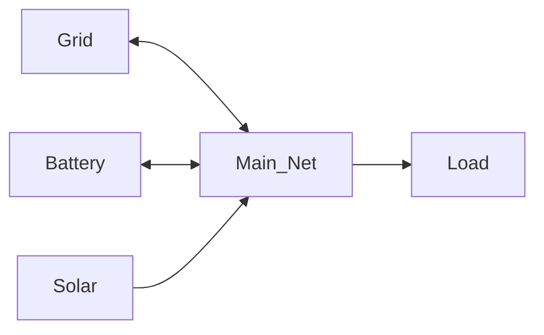

# Net Entity Configuration

Net entities are virtual nodes that represent power balance points in your network.
They don't physically exist but serve as connection hubs.

## Purpose

Net entities allow you to:

- Group multiple connections
- Create complex network topologies
- Model power distribution points

## Configuration

### Name

Unique identifier for the net entity.

**Example**: `Main_Net`, `Distribution_Point`

## Usage

A net entity enforces power balance: all inflows must equal all outflows.

## Related Documentation

- [Net Entity Modeling](../../modeling/net-entity.md)
- [Power Balance](../../modeling/power-balance.md)
- [Connections](../connections.md)

[:octicons-arrow-right-24: Continue to Connections](../connections.md)
