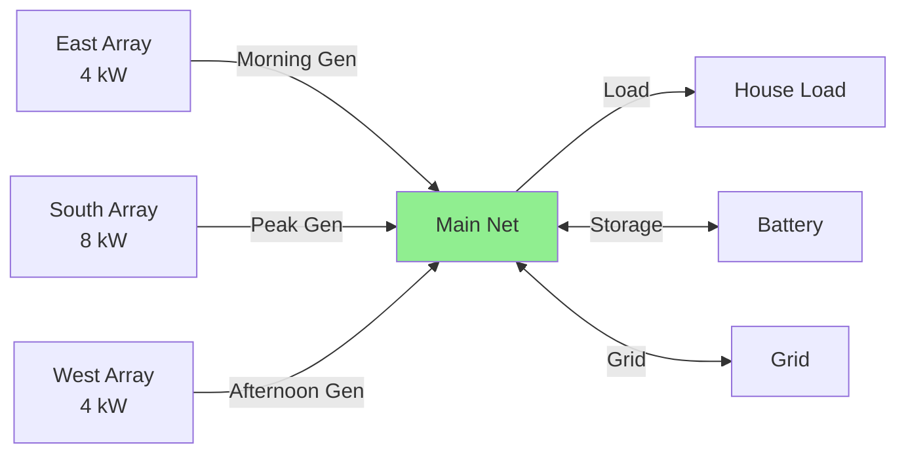

# Photovoltaics Configuration

Photovoltaics (solar panels) generate electricity from sunlight.
HAEO optimizes how this generated power is used, including when to curtail generation if economically beneficial.

## Overview

A photovoltaics system in HAEO represents:

- **Solar generation**: Power produced from sunlight based on weather forecasts
- **Optional curtailment**: Ability to reduce generation when export prices are negative
- **Production pricing**: Optional value or cost per kWh generated
- **Zero operating cost**: Solar generation itself has no fuel cost

## Configuration Fields

| Field                | Type               | Required | Default | Description                                       |
| -------------------- | ------------------ | -------- | ------- | ------------------------------------------------- |
| **Name**             | String             | Yes      | -       | Unique identifier                                 |
| **Forecast**         | Forecast sensor(s) | Yes      | -       | Solar power generation forecast                   |
| **Production Price** | Number (\$/kWh)    | No       | 0       | Value or cost per kWh of solar generation         |
| **Curtailment**      | Boolean            | No       | false   | Whether solar generation can be reduced           |

### Name

Use descriptive names that identify the solar system:

- ✅ "Rooftop Solar", "East Array", "Ground Mount", "South Panels"
- ❌ "Solar1", "PV", "solar"

If you have multiple arrays, name them by location or orientation:

- "East Panels" (morning generation)
- "West Panels" (afternoon generation)
- "South Roof" (peak midday)

### Forecast

**Forecast sensor(s)** providing solar power generation predictions.

- **Format**: Single sensor or list of sensors
- **Unit**: kW (power, not energy)
- **Required**: Yes

**Single forecast sensor**:

```yaml
Forecast: sensor.solcast_pv_forecast_forecast_today
```

**Multiple forecast sensors** (e.g., today + tomorrow):

```yaml
Forecast:
  - sensor.solar_forecast_today
  - sensor.solar_forecast_tomorrow
```

HAEO automatically merges multiple forecasts into a continuous timeline covering the optimization horizon.

!!! tip "Forecast Integrations"

    **Recommended integrations for solar forecasting**:

    - **[Solcast Solar Forecast](https://www.home-assistant.io/integrations/solcast)**: Commercial service with excellent accuracy
    - **[Open-Meteo Solar Forecast](https://github.com/rany2/ha-open-meteo-solar-forecast)**: Free, open-source weather-based forecasting
    - **[Forecast.Solar](https://www.home-assistant.io/integrations/forecast_solar)**: Free basic solar forecasting

    All provide forecast sensors compatible with HAEO.

**Forecast requirements**:

- Must cover at least the optimization horizon (default: 48 hours)
- Should update regularly (hourly or better)
- Values in kW representing expected generation at each time

### Production Price

Optional price per kWh of solar generation.

- **Type**: Number
- **Unit**: \$/kWh
- **Default**: 0 (solar is "free")
- **Optional**: Rarely used

**When to use**:

- **Positive value**: Represents feed-in tariff paid for generation (separate from export)
- **Negative value**: Represents solar contract costs or lease payments
- **Zero** (default): Solar value is implicit in reduced grid import and export revenue

**Example scenarios**:

```yaml
# Default: Solar is free, value comes from offsetting grid costs
Production Price: 0

# Feed-in tariff: Paid $0.10/kWh for all solar generation
Production Price: 0.10

# Solar lease: Cost $0.02/kWh for generated solar
Production Price: -0.02
```

!!! info "Production Price vs Export Price"

    These are different concepts:

    - **Production Price**: Value/cost of generating solar power (rarely used)
    - **Export Price** (grid entity): Revenue from exporting power to grid

    Most users should leave Production Price at 0 and configure export pricing on the grid entity.

### Curtailment

Whether solar generation can be reduced below forecast levels.

- **Type**: Boolean (true/false)
- **Default**: false (generation follows forecast exactly)
- **Optional**: Enable only if your inverter supports it

**When curtailment is disabled** (default):

- Solar generates exactly what the forecast predicts
- Cannot reduce generation, even if economically beneficial
- Simplest configuration

**When curtailment is enabled**:

- HAEO can reduce generation below forecast
- Useful when export prices are negative (you pay to export)
- Requires inverter with controllable output limiting

!!! warning "Inverter Compatibility Required"

    Only enable curtailment if your inverter supports programmatic output limiting.
    Most residential inverters do NOT support this feature.

    Check your inverter documentation for:
    - Active power limiting
    - Export limiting
    - Power curtailment modes

**When curtailment occurs**:

1. **Negative export prices**: Grid operator charges you to export
2. **Export limit exceeded**: More generation than grid can accept
3. **Battery full + low load**: Nowhere to use the excess power (rare)

## Configuration Examples

### Basic Solar System

Simple rooftop solar without curtailment:

```yaml
Name: Rooftop Solar
Forecast: sensor.solcast_pv_forecast_forecast_today
Production Price: 0
Curtailment: false
```

**Behavior**:

- Generates power according to Solcast forecast
- Power is used for self-consumption, battery charging, or export
- Cannot reduce generation, even if prices are negative

### Multiple Forecast Sources

Combining today and tomorrow forecasts:

```yaml
Name: South Roof Array
Forecast:
  - sensor.solar_forecast_today
  - sensor.solar_forecast_tomorrow
Production Price: 0
Curtailment: false
```

**Benefit**: Extends optimization horizon to 48+ hours using multiple forecast sensors.

### Solar with Curtailment

Advanced configuration for systems with controllable inverters:

```yaml
Name: Ground Mount Solar
Forecast: sensor.solcast_pv_forecast_forecast_today
Production Price: 0
Curtailment: true
```

**Behavior**:

- Generation can be reduced below forecast
- HAEO will curtail when:
    - Export prices are negative
    - Export limit is reached
    - Battery is full and load is low
- Requires inverter with active power limiting capability

### Feed-in Tariff System

Solar system with guaranteed generation payment:

```yaml
Name: Commercial Solar
Forecast: sensor.solar_forecast
Production Price: 0.15
Curtailment: false
```

**Behavior**:

- Receives $0.15/kWh for all solar generation
- Production price offsets system costs in optimization
- Typically results in maximizing solar utilization

### Multiple Solar Arrays

Different orientations for better daily coverage:

**East array** (morning generation):

```yaml
Name: East Panels
Forecast: sensor.solar_forecast_east
Production Price: 0
Curtailment: false
```

**West array** (afternoon generation):

```yaml
Name: West Panels
Forecast: sensor.solar_forecast_west
Production Price: 0
Curtailment: false
```

**Benefit**: Each array has its own forecast, capturing different sun exposure patterns throughout the day.

## How HAEO Uses Photovoltaics Configuration

### Without Curtailment (Default)

Solar generation is **fixed** according to forecast:

1. HAEO reads forecast values
2. Solar power is treated as a constant at each time step
3. Optimization determines how to **use** the solar power:
    - Self-consumption (meet load)
    - Battery charging
    - Grid export

**Solar is not a decision variable** - it's a known input to the optimization.

### With Curtailment Enabled

Solar generation becomes **optimizable**:

1. HAEO reads forecast values as **upper limits**
2. Actual generation is a decision variable: $0 \leq P_{\text{solar}}(t) \leq P_{\text{forecast}}(t)$
3. Optimization may reduce generation when:
    - Export price is negative (avoid paying to export)
    - Export limit prevents sending power to grid
    - Battery is full and load is satisfied

**Example**: 8 kW forecast, negative export price of -$0.05/kWh, 3 kW load

- **Without curtailment**: Generate 8 kW, self-consume 3 kW, export 5 kW, pay $0.25
- **With curtailment**: Generate 3 kW (curtail 5 kW), self-consume 3 kW, save $0.25

### Integration with Battery

Solar and battery work together:

**Morning** (solar ramping up):

- Solar charges battery
- Excess may export to grid

**Midday** (peak solar):

- Solar meets all load
- Charges battery to full
- Exports significant excess

**Evening** (solar declining):

- Battery supplements declining solar
- Maintains load coverage
- Minimizes grid import

**Night** (no solar):

- Battery provides power
- Grid imports as needed
- Battery charges during off-peak if needed for next day

## Sensors Created

HAEO creates these sensors for each photovoltaics entity:

| Sensor                    | Unit | Description                                         |
| ------------------------- | ---- | --------------------------------------------------- |
| `{name}_power`            | kW   | Current optimized solar generation power            |
| `{name}_power` (forecast) | kW   | Forecast of optimal generation for future periods   |

**Power sensor attributes**:

- `state`: Current period optimal power (kW)
- `forecast`: Array of future optimal power values with timestamps

**Example**:

```yaml
sensor.rooftop_solar_power:
  state: 6.2  # Currently generating 6.2 kW
  attributes:
    forecast:
      - datetime: "2025-10-12T11:05:00+00:00"
        value: 6.5
      - datetime: "2025-10-12T11:10:00+00:00"
        value: 6.8
      # ... more forecast values
```

!!! note "Curtailment in Sensors"

    When curtailment is enabled, the power sensor shows **optimal generation**, which may be less than the forecast.

    Compare `{name}_power` (actual) with forecast input to see if curtailment occurred.

## Troubleshooting

### No Solar Generation Shown

If solar power sensors show zero or unavailable:

1. **Check forecast sensor**: Ensure forecast entity exists and has data
2. **Verify units**: Forecast must be in kW, not W or kWh
3. **Check time alignment**: Forecast must cover current time
4. **Review connections**: Solar must be connected to the network
5. **Optimization status**: Check network optimization status sensor

### Solar Not Curtailing (When Expected)

If curtailment is enabled but not occurring when expected:

1. **Verify curtailment enabled**: Check configuration has `Curtailment: true`
2. **Check export prices**: Are they actually negative?
3. **Review export limits**: Is export truly constrained?
4. **Battery capacity**: Is battery actually full?
5. **Load magnitude**: Is load actually fully met?

HAEO only curtails when it's economically beneficial or physically necessary.

### Forecast Values Seem Wrong

If generation forecasts don't match expectations:

1. **Verify sensor**: Check forecast sensor in Home Assistant developer tools
2. **Units**: Ensure forecast is in kW (power) not kWh (energy)
3. **Timezone**: Verify forecast timestamps align with local time
4. **System size**: Ensure forecast matches your actual solar capacity
5. **Weather accuracy**: Forecast services depend on weather prediction accuracy

### Multiple Arrays Not Working Together

If multiple arrays aren't optimizing correctly:

1. **Separate entities**: Each array should be its own photovoltaics entity
2. **Separate forecasts**: Each array needs its own forecast sensor
3. **Separate connections**: Each array connects independently to network
4. **Name clarity**: Use distinct names (East Panels, West Panels)

## Multiple Photovoltaics Systems

HAEO supports multiple solar arrays in the same network:

**Why multiple arrays?**:

- Different orientations (east, west, south)
- Different locations (roof, ground, carport)
- Different technologies (standard panels, bifacial, tracking)
- Independent forecasting for each

**Configuration**:

1. Create separate photovoltaics entities for each array
2. Use distinct names identifying each array
3. Provide separate forecast sensors for each
4. Connect each array to the network (typically same net entity)

**Optimization behavior**:

- HAEO optimizes all arrays together
- Each array's generation is independent
- Curtailment (if enabled) can be different for each array
- Total system generation is the sum of all arrays

**Example topology**:



**Daily profile example**:

| Time        | East | South | West | Total |
| ----------- | ---- | ----- | ---- | ----- |
| 06:00-09:00 | 3 kW | 4 kW  | 0 kW | 7 kW  |
| 09:00-15:00 | 2 kW | 8 kW  | 2 kW | 12 kW |
| 15:00-18:00 | 0 kW | 4 kW  | 3 kW | 7 kW  |

Better total coverage throughout the day compared to single orientation.

## Related Documentation

- [Photovoltaics Modeling](../../modeling/photovoltaics.md) - Mathematical details
- [Grid Configuration](grid.md) - Export pricing that affects solar value
- [Battery Configuration](battery.md) - Storage for excess solar
- [Connections](../connections.md) - Connecting solar to the network
- [Forecasts & Sensors](../forecasts-and-sensors.md) - Creating forecast sensors

## Next Steps

After configuring your photovoltaics:

- [Configure loads](loads.md) to model consumption
- [Set up connections](../connections.md) to complete network topology
- [Review forecasts setup](../forecasts-and-sensors.md) for accurate solar predictions

[:octicons-arrow-right-24: Continue to Load Configuration](loads.md)
