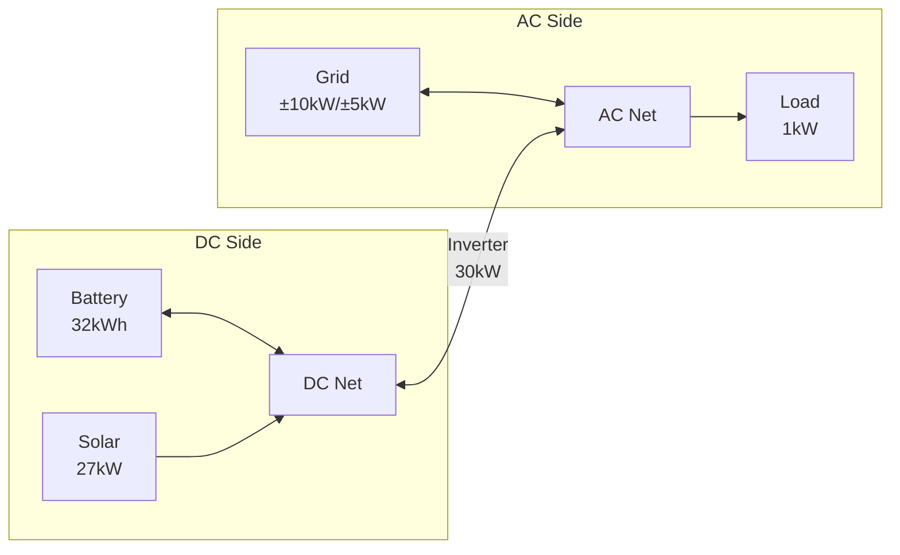

# Complete Example: Sigenergy System with Hybrid Inverter

This guide demonstrates configuring a Sigenergy system with hybrid inverter architecture, multiple solar arrays, and grid connection.

## System Overview

This example uses the test system configuration:

- **Battery**: 32 kWh (Sigenergy SigenStor), 99% efficiency
- **Solar**: 27 kW peak (four orientations: East, North, South, West)
- **Inverter**: 30 kW hybrid inverter (DC/AC coupling)
- **Grid**: 10 kW import limit, 5 kW export limit
- **Load**: 1 kW constant base load



## Prerequisites

- Home Assistant with HAEO installed
- Sigenergy integration providing battery SOC sensor
- Solar forecast sensors (Solcast, Forecast.Solar, or similar)
- Electricity price sensors

## Configuration Steps

### Step 1: Create HAEO Network

Configure the network through Settings → Devices & Services → Add Integration → HAEO:

```yaml
Name: Sigenergy System
Horizon Hours: 48
Period Minutes: 5
```

### Step 2: Add DC Net

Create the DC side network element:

```yaml
Name: DC Net
```

### Step 3: Add AC Net

Create the AC side network element:

```yaml
Name: AC Net
```

### Step 4: Add Battery

Configure the Sigenergy battery on the DC side:

```yaml
Name: Battery
Capacity: 32 kWh
Initial Charge Percentage: sensor.sigen_plant_battery_state_of_charge
Min Charge Percentage: 10%
Max Charge Percentage: 100%
Efficiency: 99%
Max Charge Power: 16.8 kW
Max Discharge Power: 19.2 kW
Charge Cost: -0.0001 $/kWh
Discharge Cost: 0.02 $/kWh
```

!!! info "Battery Sensor"

    Replace `sensor.sigen_plant_battery_state_of_charge` with your actual Sigenergy SOC sensor.
    Find it in Developer Tools → States.

### Step 5: Add Solar (Photovoltaics)

Configure solar arrays with forecast sensors for each orientation:

```yaml
Name: Solar
Forecast:
  - sensor.energy_production_today_east
  - sensor.energy_production_today_north
  - sensor.energy_production_today_south
  - sensor.energy_production_today_west
  - sensor.energy_production_tomorrow_east
  - sensor.energy_production_tomorrow_north
  - sensor.energy_production_tomorrow_south
  - sensor.energy_production_tomorrow_west
Curtailment: true
Production Price: 0 $/kWh
```

!!! tip "Solar Forecast Sensors"

    This example uses Solcast forecasts with separate sensors for each array orientation.
    If you have a single combined forecast sensor, use that instead.

### Step 6: Add Grid Connection

Configure grid with pricing and limits:

```yaml
Name: Grid
Import Price: sensor.home_general_forecast
Export Price: sensor.home_feed_in_forecast
Import Limit: 10 kW
Export Limit: 5 kW
```

!!! info "Price Sensors"

    Replace with your actual price forecast sensors.
    See [Forecasts & Sensors](../forecasts-and-sensors.md) for creating constant-price forecasts if needed.

### Step 7: Add Load

Configure the constant base load:

```yaml
Name: Constant Load
Power: 1 kW
```

### Step 8: Create Connections

Connect elements to create the hybrid inverter topology:

#### DC Side Connections

**Battery to DC Net** (bidirectional):

```yaml
Source: Battery
Target: DC Net
```

**Solar to DC Net** (unidirectional):

```yaml
Source: Solar
Target: DC Net
```

#### AC Side Connections

**Grid to AC Net** (bidirectional):

```yaml
Source: Grid
Target: AC Net
```

**AC Net to Load** (unidirectional):

```yaml
Source: AC Net
Target: Constant Load
```

#### Inverter Connection

**AC Net to DC Net** (bidirectional, 30kW limit):

```yaml
Source: AC Net
Target: DC Net
Min Power: -30 kW
Max Power: 30 kW
```

This connection models the hybrid inverter with its 30 kW power limit.

## Verification

After configuration:

1. **Check network device page** - Verify all elements are listed
2. **Wait for first optimization** - Allow the initial run to complete before validating sensors
3. **Check status sensor** - Should show `optimal`
4. **Review forecast attributes** - Each element sensor includes forecast data

Key sensors created:

- `sensor.sigenergy_system_optimization_cost`
- `sensor.sigenergy_system_optimization_status`
- `sensor.battery_power`, `sensor.battery_energy`, `sensor.battery_soc`
- `sensor.solar_power`
- `sensor.grid_power`
- `sensor.constant_load_power`

## Architecture Notes

This hybrid inverter configuration uses:

- **Separate DC and AC nets** modeling physical separation
- **Inverter connection** with 30 kW limit between nets
- **Battery and solar on DC side** (DC-coupled)
- **Grid and load on AC side**

The inverter connection power limit ensures:

- AC→DC charging cannot exceed 30 kW
- DC→AC discharge cannot exceed 30 kW
- Realistic system constraints are modeled

See [Node](../elements/node.md) for more on hybrid inverter modeling.
