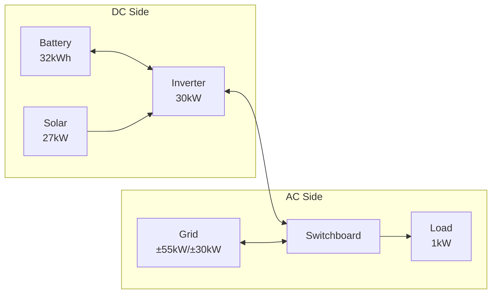

# Complete Example: Sigenergy System with Hybrid Inverter

This guide demonstrates configuring a Sigenergy system with hybrid inverter architecture, multiple solar arrays, and grid connection.

## System Overview

This example uses the test system configuration:

- **Battery**: 32 kWh (Sigenergy SigenStor), 99% efficiency
- **Solar**: 27 kW peak (four orientations: East, North, South, West)
- **Inverter**: 30 kW hybrid inverter (DC/AC coupling)
- **Grid**: 55 kW import limit, 30 kW export limit
- **Load**: 1 kW constant base load

## Prerequisites

Before starting this configuration, ensure you have:

### Required Integrations

- **HAEO**: Installed via HACS (see [Installation guide](../installation.md))
- **Sigenergy**: Provides battery capacity and SOC sensors
- **Solar Forecast**: [Open-Meteo Solar Forecast](https://www.home-assistant.io/integrations/open_meteo_solar_forecast/) integration
- **Electricity Pricing**: Any integration providing import/export price forecasts

### Configuration Requirements

- Multiple solar array orientations configured in forecast integration
- Battery SOC sensor available from Sigenergy integration
- Constant load value determined (see [Load configuration](../elements/load.md#determining-your-baseline))

## Configuration Steps

### Step 1: Create HAEO Network

Configure the network through Settings → Devices & Services → Add Integration → HAEO:

| Field              | Value            |
| ------------------ | ---------------- |
| **Name**           | Sigenergy System |
| **Tier 1 Count**   | 5                |
| **Tier 1 Duration**| 1                |
| **Tier 2 Count**   | 11               |
| **Tier 2 Duration**| 5                |
| **Tier 3 Count**   | 46               |
| **Tier 3 Duration**| 30               |
| **Tier 4 Count**   | 48               |
| **Tier 4 Duration**| 60               |

After submitting, you should see a Switchboard element already exists. This is the AC power balance point where grid and loads connect.

### Step 2: Add Inverter

The Inverter element models your hybrid inverter with its built-in DC bus. Battery and solar will connect to this element.

| Field                  | Value                            |
| ---------------------- | -------------------------------- |
| **Name**               | Inverter                         |
| **AC Connection**      | Switchboard                      |
| **Max DC to AC power** | Sigen Plant Max Active Power     |
| **Max AC to DC power** | Sigen Plant Max Active Power     |

!!! tip "Selecting Sensors"

    In the entity picker, search for "max active power" to find the sensor.
    HAEO entity pickers search by **friendly name**, not entity ID.

### Step 3: Add Battery

Configure the Sigenergy battery, connecting to the Inverter's DC side:

| Field                         | Value                                     |
| ----------------------------- | ----------------------------------------- |
| **Name**                      | Battery                                   |
| **Connection**                | Inverter                                  |
| **Capacity**                  | Sigen Plant Rated Energy Capacity         |
| **Current Charge Percentage** | Sigen Plant Battery State of Charge       |
| **Min Charge Percentage**     | 10                                        |
| **Max Charge Percentage**     | 100                                       |
| **Efficiency**                | 99                                        |
| **Max Charge Power**          | Sigen Plant Ess Rated Charging Power      |
| **Max Discharge Power**       | Sigen Plant Ess Rated Discharging Power   |
| **Early Charge Incentive**    | 0.001                                     |
| **Discharge Cost**            | *(optional)*                              |

!!! tip "Searching for Battery Sensors"

    Use these search terms in entity pickers:

    - "rated energy capacity" for battery capacity
    - "state of charge" for current SOC
    - "charging" for max charge power
    - "discharging" for max discharge power

### Step 4: Add Solar

Configure solar arrays with forecast sensors for each orientation, connecting to the Inverter's DC side:

| Field            | Value          |
| ---------------- | -------------- |
| **Name**         | Solar          |
| **Connection**   | Inverter       |
| **Forecast**     | *(see below)*  |
| **Curtailment**  | Yes            |

For the Forecast field, use the "Add entity" button to select multiple sensors. With Open-Meteo Solar Forecast for four orientations, search and select:

1. Search "East solar" → Select "East solar production forecast...today"
2. Click "Add entity"
3. Search "North solar" → Select "North solar production forecast...today"
4. Click "Add entity"
5. Search "South solar" → Select "South solar production forecast...today"
6. Click "Add entity"
7. Search "West solar" → Select "West solar production forecast...today"

!!! tip "Multi-Select Entity Pickers"

    For fields that accept multiple sensors, an "Add entity" button appears after selecting the first sensor.
    Click it to add additional sensors one at a time.

### Step 5: Add Grid Connection

Configure grid with pricing and limits, connecting to the Switchboard:

| Field            | Value                |
| ---------------- | -------------------- |
| **Name**         | Grid                 |
| **Connection**   | Switchboard          |
| **Import Price** | Home - General Price |
| **Export Price** | Home - Feed In Price |
| **Import Limit** | 55                   |
| **Export Limit** | 30                   |

!!! tip "Finding Price Sensors"

    Search for "General Price" for import pricing and "Feed In" for export pricing.
    Your integration may use different naming - look for sensors with price forecast attributes.

### Step 6: Add Load

Configure the base load consumption, connecting to the Switchboard:

| Field          | Value                      |
| -------------- | -------------------------- |
| **Name**       | Load                       |
| **Connection** | Switchboard                |
| **Forecast**   | Sigen Plant Consumed Power |

!!! tip "Load Sensors"

    Search for "consumed" to find consumption forecast sensors.
    If you don't have a load forecast, create an input_number helper for constant load:

    1. Settings → Devices & Services → Helpers
    2. Create Helper → Number
    3. Name: "Constant Load Power", Unit: kW, Value: 1.0

## Verification

After completing configuration:

1. **Navigate to Settings → Devices & Services → HAEO**
2. **Click on "Sigenergy System" hub** to view the device page
3. **Verify device/entity counts**: Should show 8 devices and 42 entities
4. **Wait for first optimization** - Allow initial run to complete (may take 5-30 seconds)
5. **Check optimization status** - Should show `success`

### Expected Device Hierarchy

In the HAEO integration page, you should see:

| Element               | Type     | Entities |
|-----------------------|----------|----------|
| Sigenergy System      | Network  | 3        |
| Switchboard           | Node     | 1        |
| Inverter              | Inverter | 8        |
| Battery               | Battery  | 6        |
| Battery Normal Region | Region   | 9        |
| Solar                 | Solar    | 3        |
| Grid                  | Grid     | 9        |
| Load                  | Load     | 3        |

### Key Sensors to Monitor

**Network-level**:

- `sensor.sigenergy_system_optimization_cost` - Total forecasted cost (\$)
- `sensor.sigenergy_system_optimization_status` - Should show "success"
- `sensor.sigenergy_system_optimization_duration` - Solve time (seconds)

**Battery**:

- `sensor.battery_power_consumed` - Charging power (kW)
- `sensor.battery_power_produced` - Discharging power (kW)
- `sensor.battery_energy_stored` - Current energy level (kWh)
- `sensor.battery_battery_state_of_charge` - SOC percentage (%)

**Solar**:

- `sensor.solar_power_produced` - Optimal generation (kW)
- `sensor.solar_power_available` - Available before curtailment (kW)

**Grid**:

- `sensor.grid_power_imported` - Import from grid (kW)
- `sensor.grid_power_exported` - Export to grid (kW)
- `sensor.grid_price_import` - Current import price (\$/kWh)
- `sensor.grid_price_export` - Current export price (\$/kWh)

**Load**:

- `sensor.load_power_consumed` - Load consumption (kW)

**Inverter**:

- `sensor.inverter_power_dc_to_ac` - DC→AC power flow (kW)
- `sensor.inverter_power_ac_to_dc` - AC→DC power flow (kW)
- `sensor.inverter_power_active` - Net AC power (kW)

All sensors include a `forecast` attribute with future optimized values.

!!! tip "Inspecting Device Details"

    Click on any device in the HAEO integration page to see:

    - All sensors created by that element
    - Current sensor values and states
    - Forecast attributes (click on sensor → attributes tab)
    - Entity IDs for use in automations

    This is helpful for understanding what data each element provides and troubleshooting configuration issues.

## Architecture Notes

This hybrid inverter configuration uses the Inverter element which provides:

- **Built-in DC bus** for battery and solar connections
- **Bidirectional AC/DC conversion** with power limits
- **AC connection** to the Switchboard where grid and loads connect

The Inverter element simplifies configuration compared to manual DC/AC nets with connection elements, while accurately modeling:

- DC→AC export cannot exceed inverter rating
- AC→DC charging cannot exceed inverter rating
- Battery and solar share the DC bus capacity

See [Node](../elements/node.md) for more on hybrid inverter modeling.
