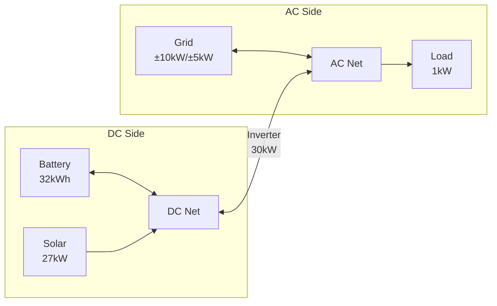

# Complete Example: Sigenergy System with Hybrid Inverter

This guide demonstrates configuring a Sigenergy system with hybrid inverter architecture, multiple solar arrays, and grid connection.

## System Overview

This example uses the test system configuration:

- **Battery**: 32 kWh (Sigenergy SigenStor), 99% efficiency
- **Solar**: 27 kW peak (four orientations: East, North, South, West)
- **Inverter**: 30 kW hybrid inverter (DC/AC coupling)
- **Grid**: 55 kW import limit, 30 kW export limit
- **Load**: 1 kW constant base load



## Prerequisites

Before starting this configuration, ensure you have:

### Required Integrations

- **HAEO**: Installed via HACS (see [Installation guide](../installation.md))
- **Sigenergy**: Provides battery capacity and SOC sensors
- **Solar Forecast**: [Open-Meteo Solar Forecast](https://www.home-assistant.io/integrations/open_meteo_solar_forecast/) integration
- **Electricity Pricing**: Any integration providing import/export price forecasts

### Configuration Requirements

- Multiple solar array orientations configured in forecast integration
- Battery SOC sensor available from Sigenergy integration
- Constant load value determined (see [Load configuration](../elements/load.md#determining-your-baseline))

## Configuration Steps

### Step 1: Create HAEO Network

Configure the network through Settings → Devices & Services → Add Integration → HAEO:

```yaml
Name: Sigenergy System
Horizon Hours: 48
Period Minutes: 5
```

### Step 2: Add DC Net

Create the DC side network element:

```yaml
Name: DC Net
```

### Step 3: Add AC Net

Create the AC side network element:

```yaml
Name: AC Net
```

### Step 4: Add Battery

Configure the Sigenergy battery on the DC side:

| Field                         | Value                                          |
| ----------------------------- | ---------------------------------------------- |
| **Name**                      | Battery                                        |
| **Capacity**                  | sensor.sigen_plant_rated_energy_capacity       |
| **Current Charge Percentage** | sensor.sigen_plant_battery_state_of_charge     |
| **Min Charge Percentage**     | 10                                             |
| **Max Charge Percentage**     | 100                                            |
| **Efficiency**                | 99                                             |
| **Max Charge Power**          | sensor.sigen_plant_ess_rated_charging_power    |
| **Max Discharge Power**       | sensor.sigen_plant_ess_rated_discharging_power |
| **Early Charge Incentive**    | 0.001                                          |
| **Discharge Cost**            | 0.02                                           |

!!! tip "Using Sigenergy Sensors for Power Ratings"

    The Sigenergy integration provides sensors for battery capacity and charge/discharge power limits.
    This ensures your configuration automatically matches your actual hardware specifications.

!!! info "Battery Sensor"

    Replace `sensor.sigen_plant_battery_state_of_charge` with your actual Sigenergy SOC sensor.
    Find it in Developer Tools → States.

### Step 5: Add Solar (Photovoltaics)

Configure solar arrays with forecast sensors for each orientation:

| Field                | Value                                                                                                                                                                                                                                                                                                                  |
| -------------------- | ---------------------------------------------------------------------------------------------------------------------------------------------------------------------------------------------------------------------------------------------------------------------------------------------------------------------- |
| **Name**             | Solar                                                                                                                                                                                                                                                                                                                  |
| **Forecast**         | sensor.energy_production_today_east, sensor.energy_production_today_north, sensor.energy_production_today_south, sensor.energy_production_today_west, sensor.energy_production_tomorrow_east, sensor.energy_production_tomorrow_north, sensor.energy_production_tomorrow_south, sensor.energy_production_tomorrow_west |
| **Curtailment**      | Yes                                                                                                                                                                                                                                                                                                                    |
| **Production Price** | 0                                                                                                                                                                                                                                                                                                                      |

!!! tip "Solar Forecast Sensors"

    This example uses Open-Meteo Solar Forecast with separate sensors for each array orientation.
    Open-Meteo provides free solar forecasts with excellent accuracy.
    If you have a single combined forecast sensor, use that instead.

### Step 6: Add Grid Connection

Configure grid with pricing and limits:

| Field            | Value                                                   |
| ---------------- | ------------------------------------------------------- |
| **Name**         | Grid                                                    |
| **Import Price** | sensor.home_general_price, sensor.home_general_forecast |
| **Export Price** | sensor.home_feed_in_price, sensor.home_feed_in_forecast |
| **Import Limit** | 55                                                      |
| **Export Limit** | 30                                                      |

!!! info "Price Sensors"

    Replace with your actual price forecast sensors.
    See [Forecasts & Sensors](../forecasts-and-sensors.md) for creating constant-price forecasts if needed.

### Step 7: Add Load

Configure the constant base load using an input_number helper:

| Field        | Value                            |
| ------------ | -------------------------------- |
| **Name**     | Constant Load                    |
| **Forecast** | input_number.constant_load_power |

**Creating the input_number**:

1. Navigate to Settings → Devices & Services → Helpers
2. Click **Create Helper** → **Number**
3. Set:
    - **Name**: "Constant Load Power"
    - **Unit**: kW
    - **Initial value**: 1.0
    - **Minimum**: 0
    - **Maximum**: 10

### Step 8: Create Connections

Connect elements to create the hybrid inverter topology.
For each connection below, click the **`:` menu button** on the hub page and select **Add Entry** → **Connection**.

#### DC Side Connections

**DC Net to Battery** (bidirectional):

| Field                       | Value                         |
| --------------------------- | ----------------------------- |
| **Name**                    | DC Net->Battery               |
| **Source**                  | DC Net                        |
| **Target**                  | Battery                       |
| **Max Power Source→Target** | _(leave empty for unlimited)_ |
| **Max Power Target→Source** | _(leave empty for unlimited)_ |

**Solar to DC Net** (unidirectional):

| Field      | Value         |
| ---------- | ------------- |
| **Name**   | Solar->DC Net |
| **Source** | Solar         |
| **Target** | DC Net        |

#### AC Side Connections

**Grid to AC Net** (bidirectional):

| Field      | Value        |
| ---------- | ------------ |
| **Name**   | Grid->AC Net |
| **Source** | Grid         |
| **Target** | AC Net       |

**Constant Load to AC Net** (unidirectional):

| Field      | Value         |
| ---------- | ------------- |
| **Name**   | Load->AC Net  |
| **Source** | Constant Load |
| **Target** | AC Net        |

#### Inverter Connection

**DC Net to AC Net** (bidirectional, represents 30kW hybrid inverter):

| Field                       | Value    |
| --------------------------- | -------- |
| **Name**                    | Inverter |
| **Source**                  | DC Net   |
| **Target**                  | AC Net   |
| **Max Power Source→Target** | 30       |
| **Max Power Target→Source** | 30       |

The inverter connection models the AC/DC power conversion with its 30 kW capacity limit in both directions.

## Verification

After completing configuration:

1. **Navigate to Settings → Devices & Services → HAEO**
2. **Click on "Sigenergy System" hub** to view the device page
3. **Verify all elements are listed** in the devices section
4. **Wait for first optimization** - Allow initial run to complete (may take 5-30 seconds)
5. **Check optimization status** - Should show `success`

### Inspect Device Hierarchy

In the HAEO integration page, you should see:

- **Network device**: "Sigenergy System" with optimization sensors
- **Element devices**: Battery, Solar, Grid, Constant Load, DC Net, AC Net
- **Connection devices**: Each connection creates a device with power flow sensors

### Key Sensors to Monitor

**Network-level**:

- `sensor.sigenergy_system_optimization_cost` - Total forecasted cost (\$)
- `sensor.sigenergy_system_optimization_status` - Should show "success"
- `sensor.sigenergy_system_optimization_duration` - Solve time (seconds)

**Battery**:

- `sensor.battery_power_consumed` - Charging power (kW)
- `sensor.battery_power_produced` - Discharging power (kW)
- `sensor.battery_energy_stored` - Current energy level (kWh)
- `sensor.battery_battery_state_of_charge` - SOC percentage (%)

**Solar**:

- `sensor.solar_power_produced` - Optimal generation (kW)
- `sensor.solar_power_available` - Available before curtailment (kW)

**Grid**:

- `sensor.grid_power_imported` - Import from grid (kW)
- `sensor.grid_power_exported` - Export to grid (kW)
- `sensor.grid_price_import` - Current import price (\$/kWh)
- `sensor.grid_price_export` - Current export price (\$/kWh)

**Load**:

- `sensor.constant_load_power_consumed` - Load consumption (kW)

**Connections** (example for one):

- `sensor.inverter_power_flow_source_target` - DC→AC power flow (kW)
- `sensor.inverter_power_flow_target_source` - AC→DC power flow (kW)

All sensors include a `forecast` attribute with future optimized values.

!!! tip "Inspecting Device Details"

    Click on any device in the HAEO integration page to see:

    - All sensors created by that element
    - Current sensor values and states
    - Forecast attributes (click on sensor → attributes tab)
    - Entity IDs for use in automations

    This is helpful for understanding what data each element provides and troubleshooting configuration issues.

## Architecture Notes

This hybrid inverter configuration uses:

- **Separate DC and AC nets** modeling physical separation
- **Inverter connection** with 30 kW limit between nets
- **Battery and solar on DC side** (DC-coupled)
- **Grid and load on AC side**

The inverter connection power limit ensures:

- AC→DC charging cannot exceed 30 kW
- DC→AC discharge cannot exceed 30 kW
- Realistic system constraints are modeled

See [Node](../elements/node.md) for more on hybrid inverter modeling.
