# Complete Example: Sigenergy SigenStor System

This guide walks you through configuring a complete system with a Sigenergy SigenStor battery, rooftop solar using [Open-Meteo Solar Forecast](https://github.com/rany2/ha-open-meteo-solar-forecast), grid connection, and forecasted household load.

## System Overview

Our example system includes:

- **Battery**: Sigenergy SigenStor 15kWh
- **Solar**: 8kW rooftop solar with Open-Meteo forecast
- **Grid**: Time-of-use pricing with import/export
- **Load**: Household consumption with forecast

```mermaid
graph LR
    Grid[Grid Connection] <-->|±10kW| Net[Main Net]
    Battery[Sigenergy 15kWh] <-->|±6kW| Net
    Solar[Solar 8kW] -->|→| Net
    Net -->|→| Load[House Load]
```



## Prerequisites

Before starting, ensure you have:

1. **Home Assistant** 2025.4.4 or newer
2. **HAEO** installed via HACS
3. **Sigenergy integration** providing battery SOC sensor
4. **[Open-Meteo Solar Forecast](https://github.com/rany2/ha-open-meteo-solar-forecast)** installed and configured
5. **Price sensors** (or fixed prices)
6. **Load forecast sensor** (optional, can use constant load)

## Step 1: Install Open-Meteo Solar Forecast

If you haven't already:

1. Install via HACS (search for "Open-Meteo Solar Forecast")
2. Configure with your solar array details:
   - Location (latitude/longitude)
   - Peak power (8 kW in our example)
   - Azimuth and tilt
   - Module efficiency
3. Wait for forecast data to populate

See the [Open-Meteo Solar Forecast documentation](https://github.com/rany2/ha-open-meteo-solar-forecast) for detailed setup.

## Step 2: Create HAEO Network

1. Go to **Settings** → **Devices & Services**
2. Click **Add Integration**
3. Search for **HAEO**
4. Configure network:

```yaml
Name: Home Energy System
Horizon Hours: 48
Period Minutes: 5
Optimizer: HiGHS
```

Click **Submit** to create the network.

## Step 3: Add Battery

1. Open HAEO configuration
2. Select **Add Battery**
3. Configure:

```yaml
Name: Sigenergy_Battery
Capacity: 15 kWh
Initial Charge Percentage: sensor.sigenergy_battery_soc
Min Charge Percentage: 20%
Max Charge Percentage: 95%
Efficiency: 95%
Max Charge Power: 6 kW
Max Discharge Power: 6 kW
```

!!! info "Battery SOC Sensor"
    Replace `sensor.sigenergy_battery_soc` with your actual Sigenergy battery state of charge sensor entity ID. Find it in Developer Tools → States.

4. Click **Submit**

## Step 4: Add Grid Connection

1. Select **Add Grid**
2. Configure:

```yaml
Name: Main_Grid
Import Price: 0.28 $/kWh  # Or your price sensor
Export Price: 0.08 $/kWh  # Or your price sensor
Import Limit: 10 kW
Export Limit: 5 kW
```

!!! tip "Dynamic Pricing"
    If you have price forecast sensors (Amber Electric, Tibber, etc.), use them instead of fixed prices:
    
    ```yaml
    Import Price: 
      - sensor.electricity_import_price_today
      - sensor.electricity_import_price_tomorrow
    Export Price:
      - sensor.electricity_export_price_today
      - sensor.electricity_export_price_tomorrow
    ```

3. Click **Submit**

## Step 5: Add Solar (Photovoltaics)

1. Select **Add Photovoltaics**
2. Configure:

```yaml
Name: Rooftop_Solar
Forecast:
  - sensor.solar_production_forecast_estimated_energy_today
  - sensor.solar_production_forecast_estimated_energy_tomorrow
Curtailment: false
Production Price: 0 $/kWh
```

!!! warning "Open-Meteo Sensor Names"
    Open-Meteo Solar Forecast creates sensors with names like:
    
    - `sensor.solar_production_forecast_estimated_energy_today`
    - `sensor.solar_production_forecast_estimated_energy_tomorrow`
    
    Adjust based on your actual sensor names. Check Developer Tools → States to find them.

3. Click **Submit**

## Step 6: Add Load

Choose one option:

### Option A: Constant Load (Simpler)

If you don't have load forecasts:

1. Select **Add Constant Load**
2. Configure:

```yaml
Name: House_Load
Power: 2.5 kW  # Average household load
```

### Option B: Forecast Load (Better Optimization)

If you have load forecast sensors:

1. Select **Add Forecast Load**
2. Configure:

```yaml
Name: House_Load
Forecast:
  - sensor.load_forecast_today
  - sensor.load_forecast_tomorrow
```

!!! tip "Creating Load Forecasts"
    You can create simple load forecasts based on historical usage patterns using Home Assistant's Statistics sensors or external tools.

3. Click **Submit**

## Step 7: Add Net Entity

1. Select **Add Net**
2. Configure:

```yaml
Name: Main_Net
```

This creates a virtual power balance point connecting all components.

3. Click **Submit**

## Step 8: Create Connections

Now connect all entities via the net:

### Connection 1: Grid ↔ Net

```yaml
Source: Main_Grid
Target: Main_Net
Min Power: -10 kW  # Can import or export
Max Power: 10 kW
```

### Connection 2: Battery ↔ Net

```yaml
Source: Sigenergy_Battery
Target: Main_Net
Min Power: -6 kW  # Can charge or discharge
Max Power: 6 kW
```

### Connection 3: Solar → Net

```yaml
Source: Rooftop_Solar
Target: Main_Net
Min Power: 0 kW  # One-way flow
Max Power: None  # Unlimited (solar determines)
```

### Connection 4: Net → Load

```yaml
Source: Main_Net
Target: House_Load
Min Power: 0 kW  # One-way flow
Max Power: None  # Unlimited
```

## Step 9: Verify Configuration

1. Check the network device page
2. Verify all sensors are created:
   - `sensor.home_energy_system_optimization_cost`
   - `sensor.home_energy_system_optimization_status`
   - `sensor.sigenergy_battery_power`
   - `sensor.sigenergy_battery_energy`
   - `sensor.sigenergy_battery_soc`
   - `sensor.main_grid_power`
   - `sensor.rooftop_solar_power`
   - `sensor.house_load_power`

3. Wait for first optimization (may take 10-30 seconds)
4. Check optimization status sensor shows `optimal`

## Step 10: View Results

### Create Dashboard Card

```yaml
type: entities
title: HAEO Energy System
entities:
  - sensor.home_energy_system_optimization_cost
  - sensor.home_energy_system_optimization_status
  - sensor.home_energy_system_optimization_duration
  - sensor.sigenergy_battery_power
  - sensor.sigenergy_battery_soc
  - sensor.main_grid_power
  - sensor.rooftop_solar_power
  - sensor.house_load_power
```

### Visualize Forecast

Use the ApexCharts card to visualize the optimal schedule:

```yaml
type: custom:apexcharts-card
header:
  title: Optimal Power Schedule
  show: true
graph_span: 48h
series:
  - entity: sensor.sigenergy_battery_power
    name: Battery
    type: line
    data_generator: |
      return entity.attributes.forecast.map((entry) => {
        return [new Date(entry.datetime).getTime(), entry.value];
      });
  - entity: sensor.main_grid_power
    name: Grid
    type: line
    data_generator: |
      return entity.attributes.forecast.map((entry) => {
        return [new Date(entry.datetime).getTime(), entry.value];
      });
  - entity: sensor.rooftop_solar_power
    name: Solar
    type: line
    data_generator: |
      return entity.attributes.forecast.map((entry) => {
        return [new Date(entry.datetime).getTime(), entry.value];
      });
```

## Expected Behavior

With this configuration, you should see:

### Morning (6:00-10:00)

- Solar generation starts
- Excess solar charges battery
- Minimal grid import

### Midday (10:00-16:00)

- Peak solar generation
- Battery charges to max SOC
- Possible grid export if production exceeds consumption + battery capacity

### Evening (16:00-22:00)

- Solar generation decreases
- Battery discharges to cover load
- Grid import only if battery depleted

### Night (22:00-6:00)

- No solar generation
- Battery charges if electricity price is low (off-peak)
- Grid imports as needed

## Optimizing Further

### Add Time-of-Use Pricing

Replace fixed prices with dynamic sensors for better optimization:

```yaml
Import Price: sensor.electricity_import_tou
Export Price: sensor.electricity_export_tou
```

### Adjust Battery SOC Limits

Fine-tune for battery longevity vs. capacity:

```yaml
Min Charge Percentage: 30%  # More conservative
Max Charge Percentage: 85%  # Extend battery life
```

### Monitor Performance

Watch optimization duration:

- **< 2 seconds**: Excellent
- **2-5 seconds**: Good
- **> 5 seconds**: Consider reducing horizon or increasing period

## Troubleshooting

### Solar Forecast Not Working

1. Verify Open-Meteo sensors exist and update
2. Check sensor attributes contain `forecast` data
3. Ensure forecast covers 48 hours

### Battery Not Responding to Optimization

1. Check SOC sensor is updating
2. Verify battery connections are correct
3. Review price difference (import > export incentivizes battery use)

### Optimization Status Shows Infeasible

1. Check all forecasts cover the full horizon
2. Verify network is fully connected
3. Review power/energy limits aren't too restrictive

See the [troubleshooting guide](../troubleshooting.md) for more solutions.

## Next Steps

- **Create automations** to follow HAEO's recommendations
- **Monitor costs** over days/weeks to validate savings
- **Adjust parameters** based on actual performance
- **Add more entities** as your system grows

Congratulations! You've configured a complete HAEO energy optimization system! 🎉

