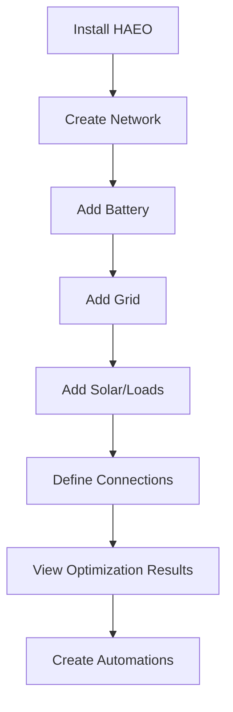

# User Guide

Welcome to the HAEO User Guide! This section will help you install, configure, and use HAEO to optimize your home's energy usage.

## What You'll Learn

This guide covers everything you need to know as an end user:

1. **[Installation](installation.md)** - Install HAEO via HACS or manually
2. **[Configuration](configuration.md)** - Set up your first energy network
3. **[Entities](entities/index.md)** - Configure batteries, grids, solar, and loads
4. **[Connections](connections.md)** - Define how energy flows between devices
5. **[Understanding Results](optimization.md)** - Interpret optimization outputs
6. **[Examples](examples/sigenergy-system.md)** - Complete system configuration walkthroughs
7. **[Troubleshooting](troubleshooting.md)** - Solve common issues

## Prerequisites

Before installing HAEO, ensure you have:

- **Home Assistant** 2025.4.4 or newer
- **HACS** installed (for HACS installation method)
- **Sensors** for:
    - Battery state of charge (if using batteries)
    - Electricity prices (current or forecast)
    - Solar forecast (if using solar)
    - Load forecast (if optimizing loads)

!!! tip "Forecast Sensors"
    Many integrations provide forecast data that HAEO can use:
    
    - **Electricity prices**: Amber Electric, Nordpool, Tibber
    - **Solar forecast**: [Open-Meteo Solar Forecast](https://github.com/rany2/ha-open-meteo-solar-forecast), Solcast
    - **Load forecast**: Custom sensors based on your usage patterns

## Quick Start Path

## Installation Methods

We recommend installing via HACS for automatic updates, but manual installation is also supported.

[:octicons-arrow-right-24: Continue to Installation](installation.md)

## Example Systems

Not sure where to start? Check out our complete system examples:

- **[Sigenergy System](examples/sigenergy-system.md)** - Battery, solar, grid, and forecast load

These examples show real-world configurations with all the details you need to replicate similar setups.

## Getting Help

If you run into issues:

1. Check the **[Troubleshooting](troubleshooting.md)** page for common problems
2. Search existing [GitHub Issues](https://github.com/ha-energy-optimiser/haeo/issues)
3. Ask in [GitHub Discussions](https://github.com/ha-energy-optimiser/haeo/discussions)
4. Report bugs by opening a new issue

!!! warning "Important"
    Always include your Home Assistant version, HAEO version, and relevant configuration (with sensitive data removed) when asking for help.

