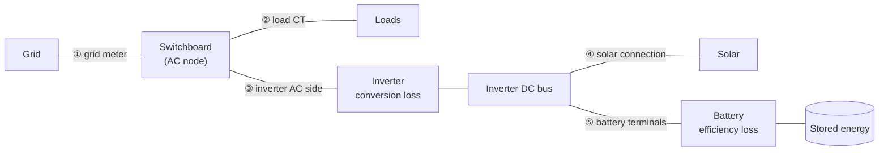

# Where values are measured

Every power value in HAEO sits at a specific point in your electrical system.
HAEO places each reported power, each power limit, and each price where real hardware meters it.
That way HAEO's numbers line up with your current transformers (CTs), battery management system (BMS), inverter, and grid meter,
and you can compare them with your own sensors or send them straight to your hardware as setpoints.

This page explains that convention and lists, for every element, where each input and each sensor applies.

## The convention

Each element is measured at its **metered terminal**, the point where an off-the-shelf device would measure it:

- **Batteries** are measured at the battery terminals, where the BMS and the battery port of a hybrid inverter measure power.
- **Inverters** are measured on the AC side, where they are rated, metered, and controlled.
- **Grid** power is measured at the grid meter.
- **Solar** and **loads** are measured where they connect to the rest of the network.

Efficiency is the internal loss between the metered terminal and the device itself.
For a battery, the loss sits between the terminals and the energy stored in the cells.
For an inverter, the loss sits between the AC side and the DC bus.
HAEO does not report these internal values as power sensors, but you can work them out from the efficiency (see [Efficiency below 100%](#efficiency-below-100)).

## The power chain

The diagram shows a typical hybrid system with solar and a battery on the inverter's DC bus.
Each labeled link is a metered terminal where HAEO reports power and applies limits.

| Point               | What HAEO reports and limits there                                      |
| ------------------- | ----------------------------------------------------------------------- |
| ① Grid meter        | Grid import and export power, import and export limits, grid prices     |
| ② Load CT           | Load power and the load forecast                                        |
| ③ Inverter AC side  | Inverter DC to AC, AC to DC, and active power, and both power limits    |
| ④ Solar connection  | Solar power and the solar forecast                                      |
| ⑤ Battery terminals | Battery charge, discharge, and active power, and both power limits      |
| Stored energy       | Energy stored, state of charge, SOC limits and costs, and salvage value |
| Inverter DC bus     | DC bus power balance shadow price                                       |

## Choosing inputs from your hardware

Because each input sits at a metered terminal, you can usually copy values straight from a datasheet or a sensor.

| Input                                   | Where to get it                                                                                                             |
| --------------------------------------- | --------------------------------------------------------------------------------------------------------------------------- |
| Battery max charge and discharge        | The battery's continuous charge and discharge rating, or the hybrid inverter's battery port rating if that is lower         |
| Battery charge and discharge efficiency | The one-way loss between the terminals and the cells; with only a round-trip figure, use its square root for each direction |
| Battery capacity and SOC                | Usable capacity and state of charge as reported by the BMS                                                                  |
| Inverter max DC to AC and AC to DC      | The inverter's continuous AC power rating in each direction                                                                 |
| Inverter efficiency                     | The inverter's conversion efficiency from its datasheet                                                                     |
| Grid import and export limits           | Your main breaker, connection agreement, or export limit, all of which apply at the meter                                   |
| Grid import and export prices           | Your tariff, which your retailer bills on metered energy                                                                    |
| Load forecast                           | A forecast of the consumption your load CT measures                                                                         |
| Solar forecast                          | A forecast of solar power at the point the solar element connects to (see [Solar](#solar))                                  |

## Element reference

The tables below list each input and each output sensor, and where in the chain it applies.
Shadow prices are in \$/kWh of energy at the stated point.

### Battery

The battery creates a charge connection and a discharge connection between its connection target and the stored energy.
The bus end of both connections is the battery terminals.

| Input                                 | Applies at                                                                                   |
| ------------------------------------- | -------------------------------------------------------------------------------------------- |
| Max charge power                      | Battery terminals: power drawn from the bus                                                  |
| Max discharge power                   | Battery terminals: power delivered to the bus                                                |
| Charge efficiency                     | Between the terminals and the stored energy: stored energy rises by power × efficiency       |
| Discharge efficiency                  | Between the stored energy and the terminals: stored energy falls by power ÷ efficiency       |
| Capacity                              | Stored energy                                                                                |
| Current charge percentage             | Stored energy                                                                                |
| Min and max charge percentage         | Stored energy                                                                                |
| Undercharge and overcharge percentage | Stored energy                                                                                |
| Undercharge and overcharge cost       | Stored energy: kWh held outside the range × hours held                                       |
| Salvage value                         | Stored energy at the end of the horizon                                                      |
| Charge cost (from a policy)           | Battery terminals                                                                            |
| Discharge cost (from a policy)        | Stored energy side of the discharge efficiency (see [Known limitations](#known-limitations)) |

| Sensor                               | Measured at                                                  |
| ------------------------------------ | ------------------------------------------------------------ |
| Charge power                         | Battery terminals                                            |
| Discharge power                      | Battery terminals                                            |
| Active power                         | Battery terminals (discharge minus charge)                   |
| Energy stored                        | Stored energy, including energy below the lowest SOC limit   |
| State of charge                      | Stored energy as a percentage of capacity                    |
| Power balance shadow price           | Stored energy: the value of one more kWh held in the battery |
| Energy in and out flow shadow prices | Stored energy                                                |
| SOC max and SOC min shadow prices    | Stored energy                                                |

### Battery section

A battery section is a raw storage element with no terminal of its own.
It has no efficiency or power limits; any losses, limits, and prices come from the segments of the [connections](#connection) you build to it.
Every battery section value therefore sits on the stored-energy side of those connections.

| Input          | Applies at    |
| -------------- | ------------- |
| Capacity       | Stored energy |
| Initial charge | Stored energy |

| Sensor                                | Measured at                                                                                           |
| ------------------------------------- | ----------------------------------------------------------------------------------------------------- |
| Charge power                          | Stored energy: the rate stored energy rises, after the efficiency of the connection feeding it        |
| Discharge power                       | Stored energy: the rate stored energy falls, before the efficiency of the connection carrying it away |
| Active power                          | Stored energy (discharge minus charge)                                                                |
| Energy stored                         | Stored energy                                                                                         |
| Power balance and other shadow prices | Stored energy                                                                                         |

A connection applies its power limit and price at its source end, where its power sensor also measures, and its efficiency after them.
Where that lands depends on the direction of the connection you build:

| Connection you build   | Power limit, price, and connection power sensor | Efficiency loss                 |
| ---------------------- | ----------------------------------------------- | ------------------------------- |
| Bus to battery section | Bus side, the terminal-like end                 | Between the bus and the section |
| Battery section to bus | Section side                                    | Between the section and the bus |

To match the [Battery](#battery) element, which limits both directions at its terminals, limit the charging connection rather than the discharging one, or read the discharging connection's limit as a section-side figure.
If your connections have an efficiency below 100%, the battery section power sensors will not match a meter on the battery terminals.

### Inverter

The inverter creates a DC to AC connection and an AC to DC connection between its DC bus and its AC connection target.
The AC end of both connections is the inverter's AC side.

| Input               | Applies at                                                           |
| ------------------- | -------------------------------------------------------------------- |
| Max power DC to AC  | AC side: power delivered to the AC network                           |
| Max power AC to DC  | AC side: power drawn from the AC network                             |
| Efficiency DC to AC | Between the DC bus and the AC side: AC power = DC power × efficiency |
| Efficiency AC to DC | Between the AC side and the DC bus: DC power = AC power × efficiency |

| Sensor                            | Measured at                       |
| --------------------------------- | --------------------------------- |
| DC to AC power                    | AC side                           |
| AC to DC power                    | AC side                           |
| Active power                      | AC side (DC to AC minus AC to DC) |
| DC bus power balance shadow price | DC bus                            |
| Max DC to AC power shadow price   | AC side                           |
| Max AC to DC power shadow price   | AC side                           |

### Solar

Solar has no efficiency of its own.
Its forecast and power sit at the point the solar element connects to.

| Input       | Applies at             |
| ----------- | ---------------------- |
| Forecast    | Solar connection point |
| Curtailment | Solar connection point |

| Sensor                      | Measured at            |
| --------------------------- | ---------------------- |
| Power                       | Solar connection point |
| Forecast limit shadow price | Solar connection point |

When solar connects to an inverter's DC bus, the forecast should describe DC power into the inverter, because the inverter's DC to AC efficiency is applied on the way to the AC side.
When solar connects to an AC node, such as with microinverters, the forecast should describe AC output.
Check which side your forecast provider describes, so inverter losses are not counted twice or left out.

### Grid

The grid's import and export connections have no efficiency, so every grid value sits at the grid meter.

| Input        | Applies at                  |
| ------------ | --------------------------- |
| Import price | Grid meter: energy imported |
| Export price | Grid meter: energy exported |
| Import limit | Grid meter                  |
| Export limit | Grid meter                  |

| Sensor                                    | Measured at                        |
| ----------------------------------------- | ---------------------------------- |
| Import power                              | Grid meter                         |
| Export power                              | Grid meter                         |
| Active power                              | Grid meter (import minus export)   |
| Import cost, export revenue, net cost     | Grid meter: metered energy × price |
| Max import and export power shadow prices | Grid meter                         |

### Load

Loads have no efficiency of their own.
The forecast and power sit at the point the load connects to.

| Input    | Applies at            |
| -------- | --------------------- |
| Forecast | Load connection point |
| Shedding | Load connection point |

| Sensor                                      | Measured at                                                                   |
| ------------------------------------------- | ----------------------------------------------------------------------------- |
| Power                                       | Load connection point                                                         |
| Forecast limit shadow price                 | Load connection point                                                         |
| Horizon and next 24h energy                 | Load connection point: power × period duration                                |
| Horizon and next 24h runtime                | Load connection point: time with nonzero power                                |
| Horizon and next 24h marginal cost          | Load energy × the power balance shadow price of the node the load connects to |
| Horizon and next 24h average marginal price | Marginal cost ÷ energy                                                        |

### Node

A node is a junction with no losses, so it is a single point in the chain.

| Sensor                     | Measured at                               |
| -------------------------- | ----------------------------------------- |
| Power balance shadow price | The node: the value of one more kWh there |

A node has no power sensor.
Read power from the elements and connections attached to it.

### Connection

A connection applies its segments in a fixed order from source to target: power limit, then price, then efficiency.
The power limit, the price, and the connection power sensor all sit at the source end, so a connection running at its limit reads exactly the limit.

| Input                       | Applies at                           |
| --------------------------- | ------------------------------------ |
| Efficiency source to target | Between the source and the target    |
| Max power source to target  | Source end: power leaving the source |
| Price source to target      | Source end: power leaving the source |

| Sensor                       | Measured at                                             |
| ---------------------------- | ------------------------------------------------------- |
| \{source} to \{target} power | Source end: power leaving the source, before efficiency |

Only the source to target fields are applied.
The connection carries power in that direction only.

### Policies

A policy price is charged on the power entering one or more connections that HAEO chooses so each unit of power pays the price exactly once.
Where it lands depends on the rule:

| Rule shape                                                                     | Price applies at                                                                                                           |
| ------------------------------------------------------------------------------ | -------------------------------------------------------------------------------------------------------------------------- |
| A specific destination, such as `* → Battery`                                  | The destination's incoming connection: battery terminals, load connection point, or grid meter                             |
| Any destination from a source with one outgoing path, such as `Battery → *`    | That source's outgoing connection, at the source end: the stored energy side for a battery, the connection point for solar |
| Several sources and destinations sharing one path, such as through an inverter | The shared connection at its source end: the DC side for an inverter's DC to AC path                                       |

Policies have no output sensors.
Their prices appear as input entities, such as the battery's charge and discharge cost.

## Changes from earlier versions

Earlier versions of HAEO placed some limits and sensors on the device side of the efficiency loss.
They now sit at the metered terminal:

| Value                          | Earlier versions                             | Now                              |
| ------------------------------ | -------------------------------------------- | -------------------------------- |
| Battery max charge power       | Energy entering storage, after charge losses | Battery terminals, before losses |
| Battery discharge power sensor | Energy leaving storage, before losses        | Battery terminals, after losses  |
| Inverter max power AC to DC    | DC bus, after rectifying losses              | AC side, before losses           |
| Inverter DC to AC power sensor | DC bus, before inverting losses              | AC side, after losses            |
| Connection max power and price | Target end, after the connection's losses    | Source end, before losses        |

If you set the battery max charge power from a cell-side figure, or the inverter max AC to DC power from a DC-side figure, re-check them against your hardware's terminal or AC rating.
A connection's max power now limits the power its sensor reports, so it no longer allows slightly more than the configured value to leave the source.
With efficiency below 100%, the same number now allows slightly less energy into storage or onto the DC bus than before.

## Known limitations

A few values do not yet sit at a metered terminal:

- **Battery discharge cost** and any policy placed on a battery's discharge connection are charged on energy drawn from storage, before the discharge efficiency.
    With 95% discharge efficiency, a 0.10 \$/kWh discharge cost works out to about 0.105 \$/kWh at the battery terminals.
- **Policies placed on an inverter's DC to AC path** are charged on the DC side, before the inverting efficiency.
- **Battery section** power sensors report the change in stored energy, not the terminals, because the efficiency lives on separate connections.

## Comparing HAEO with your own sensors

Each HAEO power sensor reports the average power over each forecast period, in kW, at the point listed above.
To compare it with your hardware, pick the sensor that measures the same point:

| HAEO sensor                        | Compare with                                                                        |
| ---------------------------------- | ----------------------------------------------------------------------------------- |
| Grid import and export power       | Your grid meter or grid CT                                                          |
| Load power                         | Your consumption CT or the inverter's load power                                    |
| Battery charge and discharge power | The BMS power or the inverter's battery power                                       |
| Battery state of charge            | The BMS state of charge                                                             |
| Inverter active power              | The inverter's AC output power                                                      |
| Solar power                        | PV input power (DC bus) or solar AC output (AC node), matching where solar connects |

Because these are the same quantities your hardware measures and accepts, you can use them directly in [automations](automations.md),
for example to set a battery charge setpoint from HAEO's charge power.

At each AC node, the metered powers balance: grid import, inverter active power, and solar on that node equal the loads and exports there.
On a DC bus the inverter's DC side power is not reported directly.
Work it out from the AC side power and the efficiency, as described below.

### Efficiency below 100%

Energy is lost between each metered terminal and the device behind it.
With charge efficiency $\eta_c$, discharge efficiency $\eta_d$, and a period of $\Delta t$ hours:

$$
\Delta E_\text{stored} = \eta_c \times P_\text{charge} \times \Delta t - \frac{P_\text{discharge}}{\eta_d} \times \Delta t
$$

| Battery power at the terminals | Efficiency | Change in energy stored over 1 hour |
| ------------------------------ | ---------- | ----------------------------------- |
| 5 kW charge                    | 95%        | +4.75 kWh                           |
| 5 kW discharge                 | 95%        | −5.26 kWh                           |

The same rule applies to inverters.
Delivering 5 kW to the AC side at 97% DC to AC efficiency draws about 5.15 kW from the DC bus.
Drawing 5 kW from the AC side at 97% AC to DC efficiency delivers 4.85 kW to the DC bus.

If HAEO's forecast state of charge drifts away from your BMS while the battery power matches, your efficiency settings are the likely cause.
While discharging, a forecast that falls faster than the BMS means the discharge efficiency is set too low, and one that falls slower means it is set too high.
While charging, a forecast that rises slower than the BMS means the charge efficiency is set too low, and one that rises faster means it is set too high.

## Next steps

- :material-battery:{ .lg .middle } **Configure your elements**

    ---

    Set up batteries, inverters, grids, solar, and loads with values from your hardware.

    [:material-arrow-right: Element configuration](elements/index.md)

- :material-chart-line:{ .lg .middle } **Understand results**

    ---

    Read the optimized schedule and the sensors HAEO creates.

    [:material-arrow-right: Understanding results](optimization.md)

- :material-robot:{ .lg .middle } **Automate your hardware**

    ---

    Send HAEO's setpoints to your battery and inverter.

    [:material-arrow-right: Automation examples](automations.md)

- :material-math-integral:{ .lg .middle } **Battery modeling**

    ---

    See how efficiency and power limits are placed in the model.

    [:material-arrow-right: Battery modeling](../modeling/device-layer/battery.md)

