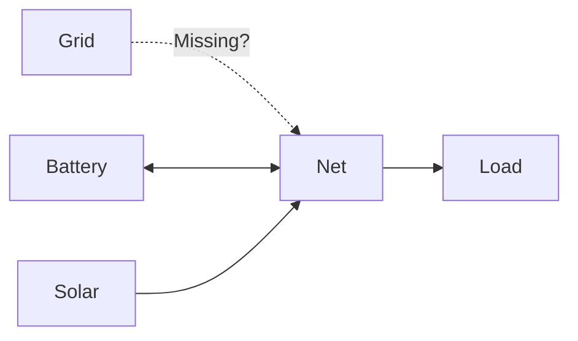
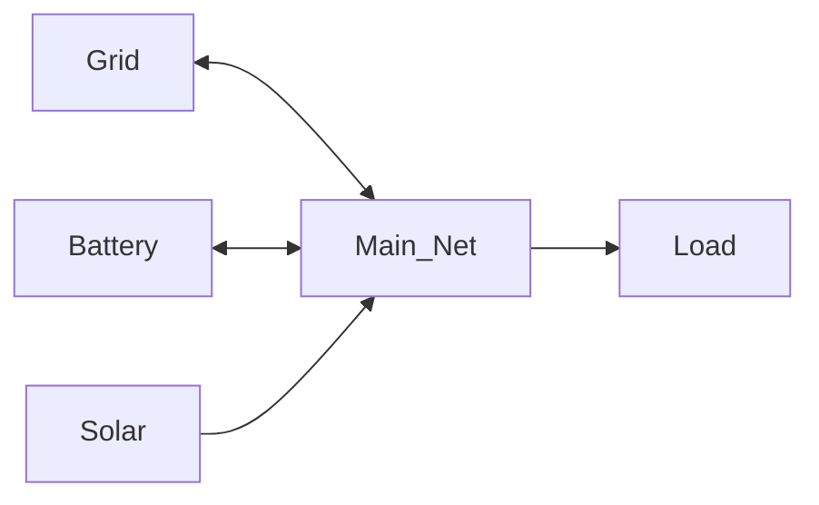

# Troubleshooting

Common issues and their solutions.

## Forecasts Are Not Long Enough

### Problem

Optimization fails or warnings about insufficient forecast data.

### Symptoms

- Optimization status shows `infeasible` or `undefined`
- Logs mention forecast length issues
- Sensors show `unknown` values

### Solutions

#### Check Forecast Length

Ensure your forecast sensors provide data for the entire optimization horizon.

**Example**: If horizon is 48 hours, forecasts must cover at least 48 hours.
Refer to the [horizon guidance](configuration.md#horizon-hours) before changing that value.

#### Verify Forecast Sensors

Check sensor attributes in Developer Tools:

1. Go to **Developer Tools** → **States**
2. Find your forecast sensor
3. Check `forecast` attribute has enough timestamped values

#### Reduce Horizon

If you can't get longer forecasts, reduce the horizon:

1. Open HAEO configuration
2. Reduce **Horizon Hours** to match your forecast length
3. Save and wait for optimization
Shorter horizons limit planning depth, so follow the [horizon guidance](configuration.md#horizon-hours) when you make this change.

#### Use Multiple Forecast Sensors

Some integrations split forecasts (today/tomorrow):

```yaml
Forecast:
  - sensor.solar_forecast_today  # 0-24 hours
  - sensor.solar_forecast_tomorrow  # 24-48 hours
```

HAEO combines them automatically.

#### Common Integrations

| Integration               | Forecast Length |
| ------------------------- | --------------- |
| Open-Meteo Solar Forecast | 7 days          |
| Solcast                   | 7 days          |
| Amber Electric            | 48 hours        |
| Custom Sensors            | Varies          |

## Graph Isn't Connected Properly

### Problem

Optimization fails because the network graph is disconnected.

### Symptoms

- Optimization status shows `infeasible`
- Some elements never show power flow
- Logs mention disconnected components

### Solutions

#### Visualize Your Network

Draw your network on paper:



Each element should have at least one connection.

#### Check All Elements Have Connections

In HAEO configuration, verify:

1. **Grid**: Connected to a net or battery
2. **Battery**: Connected to grid or net
3. **Solar**: Connected to net or battery
4. **Loads**: Connected to net or battery

#### Add Missing Connections

If an element is isolated, add connection entries to link it to the network:

1. Navigate to **Settings** → **Devices & Services**
2. Click **Add Integration** and search for "HAEO"
3. Select **Connection** as the entry type
4. Choose the isolated element as source or target
5. Connect it to another element in your network
6. Submit the connection

#### Use Nodes

For complex topologies, use nodes as connection hubs:



This ensures all elements connect to a common point.

#### Verify Connection Direction

Some connections are unidirectional:

- Solar can only **produce** (→)
- Loads can only **consume** (→)
- Grid and Battery are **bidirectional** (↔)

Ensure directions match physical capabilities.

## Optimization Takes Too Long

### Problem

Optimization duration exceeds acceptable limits.

### Solutions

If optimization takes too long:

1. **Trim horizon cautiously**: Consider smaller horizons only after other steps and follow the [horizon guidance](configuration.md#horizon-hours) when you do.
2. **Increase period**: Use larger time steps (5min → 15min)
3. **Simplify network**: Remove unnecessary elements
4. **Change solver**: Try CBC or GLPK

## Battery Not Charging/Discharging

### Problem

Battery remains idle despite price variation.

### Solutions

1. **Check SOC limits**: May be too tight
2. **Verify pricing**: Need import price > export price
3. **Check power limits**: May be too restrictive
4. **Review connections**: Battery must be connected

## Sensors Showing Unknown

### Problem

Element sensors display `unknown` values.

### Solutions

1. **Wait for optimization**: First run takes time
2. **Check optimization status**: Must be `optimal`
3. **Verify configuration**: All required fields filled
4. **Review logs**: Check for error messages

## Price Forecasts Not Working

### Problem

HAEO doesn't respond to price changes.

### Solutions

1. **Check forecast format**: Must include `datetime` and `value`
2. **Verify timestamps**: Must be ISO format with timezone
3. **Ensure forecast length**: Must cover horizon
4. **Check sensor updates**: Must update regularly

## Getting Help

If these solutions don't help:

1. **Check logs**: Settings → System → Logs
2. **GitHub Issues**: [Report a bug](https://github.com/ha-energy-optimiser/haeo/issues)
3. **Discussions**: [Ask for help](https://github.com/ha-energy-optimiser/haeo/discussions)

Include:

- Home Assistant version
- HAEO version
- Configuration (sanitized)
- Relevant logs

## Next Steps

Try these resources if you still need assistance after working through the troubleshooting steps.

<div class="grid cards" markdown>

- :material-sync:{ .lg .middle } __Review data update behaviour__

    Check how HAEO refreshes data and identify update bottlenecks.

    [:material-arrow-right: Data update guide](data-updates.md)

- :material-robot-outline:{ .lg .middle } __Check automation patterns__

    Ensure follow-up automations react correctly to optimizer outputs.

    [:material-arrow-right: Automation patterns](automations.md)

- :material-forum:{ .lg .middle } __Ask the community for help__

    Share logs and scenarios to get tailored assistance.

    [:material-arrow-right: GitHub discussions](https://github.com/ha-energy-optimiser/haeo/discussions)

</div>
