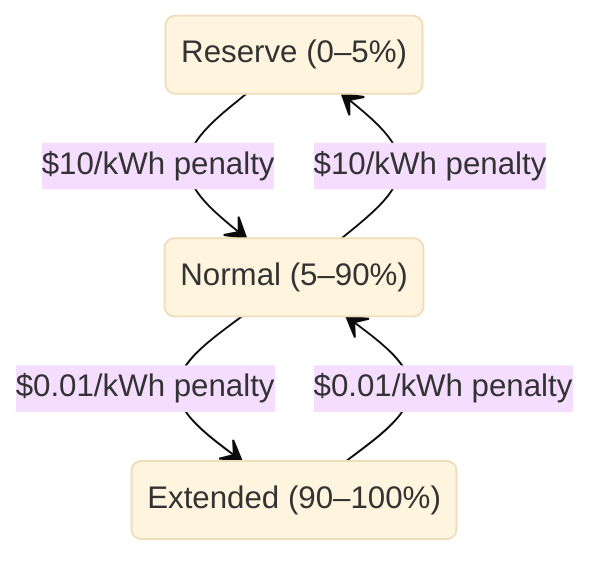

# Battery inventory costs

This guide demonstrates configuring inventory cost rules on a battery to set soft minimum and maximum charge levels.
Inventory costs let you control how aggressively HAEO uses the full range of your battery by assigning economic penalties to charge levels you want to avoid.

## What are inventory costs?

Without inventory costs, HAEO treats all charge levels equally — storing energy at 5% SOC has the same value as storing it at 90%.
Inventory cost rules change this by saying "energy below 5% costs \$10/kWh to access" or "energy above 90% costs \$0.01/kWh to store."

This lets you model real-world preferences like:

- **Hard minimum charge**: Protect against deep discharge by making the bottom 5% very expensive to access
- **Soft maximum charge**: Gently discourage charging above 90%, but allow it when there is profit to be made
- **Warranty compliance**: Keep the battery within manufacturer-recommended SOC limits most of the time

Each rule specifies a **direction** (above or below a threshold), a **threshold** in kWh, and a **cost** in \$/kWh.
The optimizer weighs these costs against grid prices and solar availability to decide whether accessing that range is worthwhile.

## Prerequisites

This guide builds on the [Sigenergy System walkthrough](sigenergy-system.md).
The setup block below replays that configuration automatically.

```guide-setup
run_guide("sigenergy-system")
```

## Adding inventory cost rules

Inventory cost rules are added to an existing battery element.
Each rule applies a cost penalty when the battery's stored energy crosses a threshold.

### Step 1: Add a firm minimum at 5%

This rule makes the bottom 5% of the battery very expensive to access.
At \$10/kWh, the optimizer will almost never discharge into this range — only during extreme price spikes.

For a 32 kWh battery, 5% corresponds to 1.6 kWh.

```guide
add_inventory_cost(
    page,
    battery_name="Battery",
    name="Min charge reserve",
    direction="below",
    threshold=1.6,
    cost=10.00,
)
```

!!! info "Why \$10/kWh?"

    A high cost like \$10/kWh acts as a near-hard limit.
    Grid prices would need to exceed \$10/kWh (extremely rare) before the optimizer would discharge into this range.
    This protects against deep discharge without making it absolutely impossible — if prices truly spike that high, the battery can still help.

### Step 2: Add a squishy maximum at 90%

This rule adds a gentle cost to charging above 90%.
At \$0.01/kWh, the optimizer will charge into the top 10% whenever it expects to earn at least 1 cent per kWh of overage.

For a 32 kWh battery, 90% corresponds to 28.8 kWh.

```guide
add_inventory_cost(
    page,
    battery_name="Battery",
    name="Soft max charge",
    direction="above",
    threshold=28.8,
    cost=0.01,
)
```

!!! tip "Squishy vs firm limits"

    The difference between a firm and squishy limit is just the cost:

    - **Firm** (\$10/kWh): Almost never crossed — acts like a hard limit with an escape valve
    - **Squishy** (\$0.01/kWh): Crossed whenever there is even a small profit opportunity

    A squishy maximum at 90% means the optimizer will happily charge to 100% if it expects to earn more than \$0.01/kWh from the extra stored energy.
    This is useful when you prefer to stay below 90% for battery longevity, but don't want to miss out on storing cheap solar for evening export.

### Step 3: Verify the rules

Check that both inventory cost rules were saved on the battery.

```guide
verify_inventory_costs(hass, battery_name="Battery", expected_rules=[
    "Min charge reserve",
    "Soft max charge",
])
```

## How inventory costs affect optimization

With these two rules configured, the optimizer sees three SOC regions:



| Region           | SOC Range | Cost       | Behavior                                         |
| ---------------- | --------- | ---------- | ------------------------------------------------ |
| Reserve          | 0–5%      | \$10/kWh   | Almost never used — emergency reserve             |
| Normal operation | 5–90%     | Free       | Preferred operating range                         |
| Extended charge  | 90–100%   | \$0.01/kWh | Used when even small profit is available          |

### Example scenario

Consider a day with cheap midday solar and expensive evening grid prices:

- **Midday**: Solar is abundant, grid export pays \$0.05/kWh.
  The optimizer charges the battery to 100% because the \$0.01/kWh overage cost is far less than the value of stored energy for evening use.
- **Evening**: Grid import costs \$0.30/kWh, load is 2 kW.
  The optimizer discharges from 100% down to 5%, avoiding \$0.30/kWh grid imports.
  It stops at 5% because the \$10/kWh reserve cost is higher than the \$0.30/kWh grid price.
- **Night**: Grid prices drop to \$0.10/kWh.
  The battery stays at 5% — still not worth paying \$10/kWh to access the reserve.

## Choosing threshold values

Inventory cost thresholds are specified in **kWh**, not percentages.
Convert from your desired SOC percentage using:

$$\text{threshold (kWh)} = \frac{\text{SOC (\%)}}{100} \times \text{capacity (kWh)}$$

For common battery sizes:

| Desired SOC | 10 kWh battery | 15 kWh battery | 32 kWh battery |
| ----------- | -------------- | -------------- | -------------- |
| 5%          | 0.5 kWh        | 0.75 kWh       | 1.6 kWh        |
| 10%         | 1.0 kWh        | 1.5 kWh        | 3.2 kWh        |
| 80%         | 8.0 kWh        | 12.0 kWh       | 25.6 kWh       |
| 90%         | 9.0 kWh        | 13.5 kWh       | 28.8 kWh       |
| 95%         | 9.5 kWh        | 14.25 kWh      | 30.4 kWh       |

## Choosing cost values

The cost determines how firmly the optimizer respects the limit.
Here are some guidelines:

| Cost          | Behavior                                                        | Use case                          |
| ------------- | --------------------------------------------------------------- | --------------------------------- |
| \$0.01/kWh   | Crossed with almost any profit opportunity                      | Gentle preference, battery health |
| \$0.10/kWh   | Crossed when grid prices are moderately high or solar is wasted | Moderate protection               |
| \$1.00/kWh   | Crossed only during significant price events                    | Strong preference                 |
| \$10.00/kWh  | Almost never crossed — effectively a hard limit                 | Emergency reserve, warranty       |
| \$100.00/kWh | Virtually never crossed under any realistic pricing             | Absolute minimum/maximum          |

!!! tip "Start simple"

    Begin with two rules: a firm minimum (high cost) and a squishy maximum (low cost).
    Adjust costs based on how the optimizer behaves in your real pricing environment.
    You can always add more rules later — for example, a moderate cost at 10% as a secondary buffer above the 5% hard floor.

## Next steps

<div class="grid cards" markdown>

-   :material-shield-check:{ .lg .middle } **Power policies**

    ---

    Control directional power flow costs between elements.

    [:material-arrow-right: Power policies walkthrough](power-policies.md)

-   :material-battery-charging:{ .lg .middle } **Battery configuration**

    ---

    Full reference for all battery configuration fields.

    [:material-arrow-right: Battery guide](../user-guide/elements/battery.md)

-   :material-chart-line:{ .lg .middle } **Optimization results**

    ---

    Interpret costs, power flows, and shadow prices.

    [:material-arrow-right: Optimization guide](../user-guide/optimization.md)

</div>
